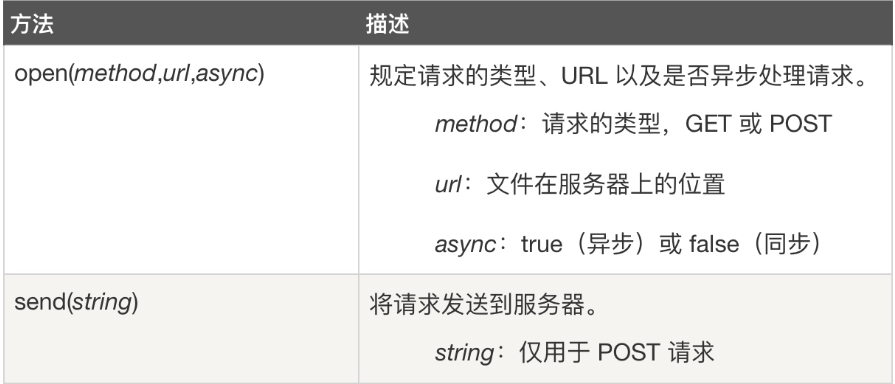
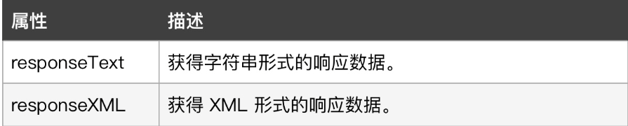
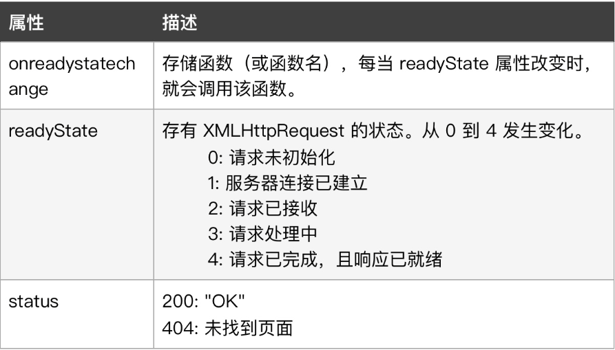
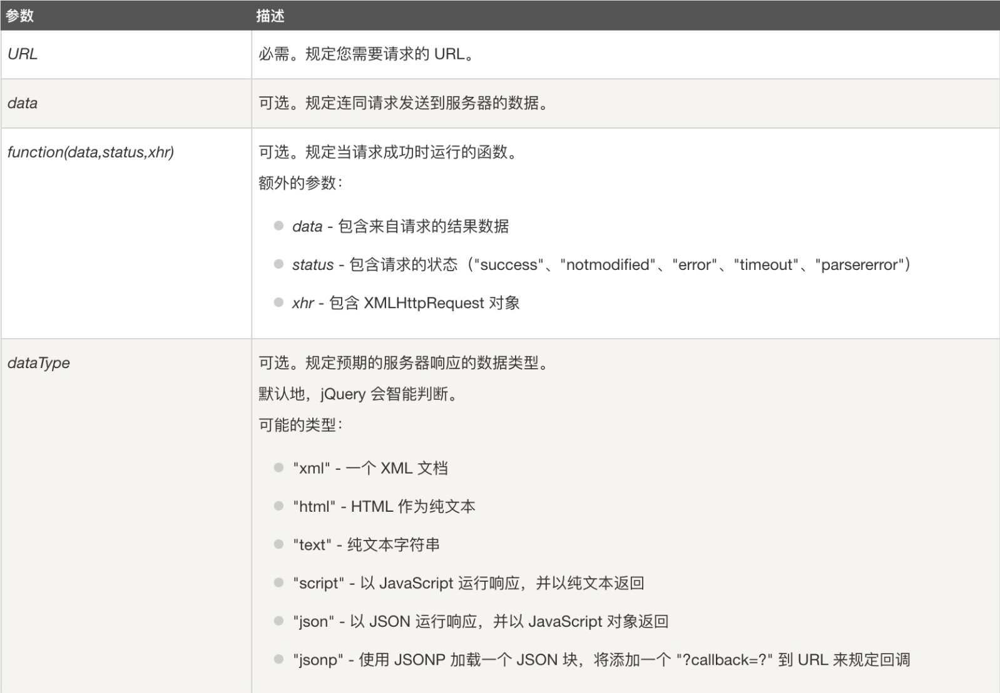

# AJAX

AJAX 即 Asynchronous JavaScript and XML（异步的 JavaScript 和 XML），它并不是新的编程语言，而是**一种使用现有标准的新方法**。AJAX 最大的优点是**在不重新加载整个页面的情况下，可以与服务器交换数据并更新部分网页内容**，AJAX 不需要任何浏览器插件，只要浏览器能执行JavaScript即可。

AJAX 可以帮助我们完成以下操作：

- 与服务器异步交互数据（XMLHttpRequest）
- 显示/取回信息（JavaScript/DOM）
- 设置数据的样式（CSS）
- 常用作数据传输的格式（JSON和XML）

## XMLHttpRequest对象

XMLHttpRequest 对象是 AJAX 的基础，通过它就可以在后台与服务器交换数据，能够让我们在不重新加载整个网页的情况下，对网页局部进行更新，且目前几乎所有的浏览器都支持（除了IE5 和 IE6，它们 使用 ActiveXObject）。我们可以直接使用 XMLHttpRequest 对象来完成请求操作。

### 使用步骤

#### **1、创建XMLHttpRequest对象**

```javascript
var xhr = new XMLHttpRequest();
```

不过，为了应对所有的现代浏览器，包括 IE5 和 IE6，在创建 XMLHttpRequest 对象时最好检查浏览器是否支持。如果支持，则创建 `XMLHttpRequest` 对象。如果不支持，则创建 `ActiveXObject` ：

```javascript
var xhr;
if (window.XMLHttpRequest){
	// code for IE7+, Firefox, Chrome, Opera, Safari
	xhr = new XMLHttpRequest();
}
else{
	// code for IE6, IE5
	xhr = new ActiveXObject("Microsoft.XMLHTTP");
}
```

#### **2、发送请求**

向服务器发送请求，我们可以使用`XMLHttpRequest`对象的 `open()` 以及 `send()` 方法。



#### **3、获取服务器响应**

我们可以通过 `XMLHttpRequest` 对象的 `responseText` 或 `responseXML` 属性来获取服务器响应信息。



#### **4、执行 onreadystatechange 事件**

请求被发送到服务器过程中，`readyState` 属性会保存 `XMLHttpRequest` 的状态信息。因此，当 `readyState` 改变时就会触发 `onreadystatechange` 事件。我们可以根据通过该事件来执行一些基于响应的任务，如下：




#### 例子：

```HTML
<!DOCTYPE html>
<html>
  <head>
    <meta charset="utf-8" />
    <title>jQuery AJAX</title>
    <style>
      #content {
        color: black;
        background-color: powderblue;
        width: 50vw;
        height: 50vh;
      }
    </style>
    <script src="https://ajax.aspnetcdn.com/ajax/jQuery/jquery-3.6.0.min.js"></script>
    <script>
      $(document).ready(function () {
        $("#requestBtn").click(function () {
          var xhr;
          if (window.XMLHttpRequest) {
            xhr = new XMLHttpRequest();
          } else {
            xhr = new ActiveXObject("Microsoft.XMLHTTP");
          }
          var urlStr =
            "https://restapi.amap.com/v3/weather/weatherInfo?city=340200&key=db7d7765dd2c4287b45df7c8a40b9aa4";
          //设置请求对象的准备状态
          xhr.onreadystatechange = function () {
            // 准备状态为已完成，且请求状态为OK时
            if (xhr.readyState == 4 && xhr.status == 200) {
              //将请求返回的数据展示在页面中
              $("#content").html(xhr.responseText);
            }
          };
          xhr.open("GET", urlStr, true);
          xhr.send();
        });
      });
    </script>
  </head>

  <body>
    <p>今天的天气怎样？</p>
    <button id="requestBtn">请求天气信息</button>
    <p></p>
    <div id="content"></div>
  </body>
</html>
```

返回的数据格式如下：

```
{
    "status": "1",
    "count": "1",
    "info": "OK",
    "infocode": "10000",
    "lives": [
        {
            "province": "安徽",
            "city": "芜湖市",
            "adcode": "340200",
            "weather": "多云",
            "temperature": "21",
            "winddirection": "东北",
            "windpower": "≤3",
            "humidity": "64",
            "reporttime": "2023-10-06 14:05:18",
            "temperature_float": "21.0",
            "humidity_float": "64.0"
        }
    ]
}
```


# JQuery中的AJAX

### get()

此方法通过 HTTP GET 请求从服务器上请求数据：

```javascript
$.get(URL, data, function(data, status, xhr), dataType)
```

### post()

此方法通过 HTTP POST 请求从服务器上请求数据，使用方式与$.get()类似：

```javascript
$.post(URL, data, function(data, status, xhr), dataType)
```

### load()

该对象方法可以从服务器加载数据，可以把 **返回的数据直接放入被选取的元素中**。语法格式如下：

```javascript
$(selector).load(url, data, function(response, status, xhr))
```



### ajax()

此方法用于执行 AJAX（异步 HTTP）请求，通过 HTTP 请求加载远程数据，该方法是 jQuery 中底层的 AJAX 实现，以上提到的 load()、get()、post() 等函数都是该函数的简化形式(都调用了该函数，只是参数设置有所不同或有所省略)，该方法语法格式如下：

```html
$.ajax({name:value, name:value, ... })
```

该方法 **通过键值对集合的形式来配置 Ajax 请求**，其中的每个属性用来指定发送请求所需的额外参数设置，常见的参数如下：

- ***type***
  String类型，设置请求方式 "POST" 或 "GET"，默认值: "GET"。注意：其它 HTTP 请求方法，如 PUT 和 DELETE 也可以使用，不过仅仅部分浏览器支持。
- ***url***
  String类型，默认值: 发送请求的地址。
- ***async***
  Boolen类型，用来设置是否进行异步请求，默认为true, 即执行异步请求。如果是同步请求，那么将锁定浏览器，直到获取到远程数据后才能执行其他操作。
- ***contentType***
  String类型，默认值: “application/x-www-form-urlencoded”，用于设置发送的内容的编码类型。默认值适合大多数情况。
- ***data***
  任意类型，发送到服务器的数据，它将被自动转为字符串类型。如果是GET请求，它将被附加到URL后面。
- ***dataType***
  String类型，该属性可以设置返回的数据类型，jQuery自动根据 HTTP 包 MIME 信息来智能猜测。该属性值可以为：
  - `xml`：返回XML文档，可使用jQuery进行处理。
  - `html`： 返回HTML字符串，包含的 script 标签会在插入 dom 时执行。
  - `script`： 返回JavaScript代码。
  - `json`： 返回JSON数据。JSON数据将使用严格的语法进行解析(属性名必须加双引号，所有字符串也必须用双引号)，如果解析失败将抛出一个错误。
  - `jsonp`： JSONP格式。
  - `text`： 返回纯文本字符串。
- ***timeout***
  Number类型，设置请求超时时间（毫秒），此设置将覆盖全局设置。
- ***cache***
  Boolean类型，默认为true，不过当dataType为`script`或`jsonp`时，默认为false。指示是否缓存URL请求。如果设为false将强制浏览器不缓存当前URL请求，该参数只对HEAD、GET请求有效(POST请求本身就不会缓存)。
- ***success***
  Function类型，指定请求成功后执行的回调函数。该函数有3个参数：请求返回的**数据**、响应**状态**字符串、**jqXHR对象**。
- ***error***
  Function类型，指定请求失败时执行的回调函数。该函数有3个参数：**jqXHR对象**、 请求**状态**字符串(null、 'timeout'、 'error'、 'abort'和'parsererror')、 **错误信息**字符串(响应状态的文本描述部分，例如'Not Found'或'Internal Server Error’)。它是一个Ajax事件，跨域脚本和跨域JSONP请求不会调用该函数。

#### 例子：

```html
<!DOCTYPE html>
<html>
  <head>
    <meta charset="utf-8" />
    <title>jQuery AJAX</title>
    <style>
      #content {
        color: black;
        background-color: powderblue;
        width: 50vw;
        height: 50vh;
      }
    </style>
    <script src="https://ajax.aspnetcdn.com/ajax/jQuery/jquery-3.6.0.min.js"></script>
    <script>
      $(document).ready(function () {
        $("#requestBtn").click(function () {
          var urlStr = "https://restapi.amap.com/v3/weather/weatherInfo";
          // 使用 AJAX 发起请求
          $.ajax({
            type: "post",
            url: urlStr,
            data: {
              city: "340200",
              key: "db7d7765dd2c4287b45df7c8a40b9aa4",
            },
            dataType: "json",
            success: function (data) {
              console.log(data);
              $("#content").html(JSON.stringify(data));
            },
            error: function (error) {
              console.error(error);
            },
          });
        });
      });
    </script>
  </head>

  <body>
    <p>今天的天气怎样？</p>
    <button id="requestBtn">请求天气信息</button>
    <p></p>
    <div id="content"></div>
  </body>
</html>
```

