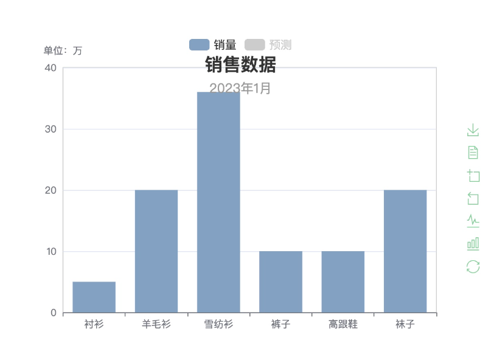

# Echarts 基础

## 一、ECharts 入门

### （一）认识 ECharts

[ECharts](https://echarts.apache.org/zh/index.html) 是一款基于JavaScript的数据可视化图表库，提供直观，生动，可交互，可个性化定制的数据可视化图表。最初由百度团队开源，并于2018年初捐赠给Apache基金会，成为ASF孵化级项目。

#### （1）发展历程

- ECharts 由百度团队开源。
- 2018年初，捐赠给Apache基金会，成为ASF孵化级项目。
- 2021年1月26日晚，Apache基金会官方宣布 ECharts项目正式毕业，成为 Apache 顶级项目。
- 2021年1月28日，ECharts 5 线上发布会举行。

#### （2）ECharts 特性

- **丰富的可视化类型**: 提供了常规的折线图、柱状图、散点图、饼图、K线图，用于统计的盒形图，用于地理数据可视化的地图、热力图、线图，用于关系数据可视化的关系图、treemap、旭日图，多维数据可视化的平行坐标，还有用于 BI 的漏斗图，仪表盘，并且支持图与图之间的混搭。
- **多种数据格式无需转换直接使用**: 内置的 dataset 属性（4.0+）支持直接传入包括二维表，key-value 等多种格式的数据源，此外还支持输入 TypedArray 格式的数据。
- **千万数据的前端展现**: 通过增量渲染技术（4.0+），配合各种细致的优化，ECharts 能够展现千万级的数据量。
- **移动端优化**: 针对移动端交互做了细致的优化，例如移动端小屏上适于用手指在坐标系中进行缩放、平移。 PC 端也可以用鼠标在图中进行缩放（用鼠标滚轮）、平移等。
- **多渲染方案**，跨平台使用: 支持以 Canvas、SVG（4.0+）、VML 的形式渲染图表。
- **深度的交互式数据探索**: 提供了 图例、视觉映射、数据区域缩放、tooltip、数据刷选等开箱即用的交互组件，可以对数据进行多维度数据筛取、视图缩放、展示细节等交互操作。
- **多维数据的支持以及丰富的视觉编码手段**: 对于传统的散点图等，传入的数据也可以是多个维度的。
- **动态数据**: 数据的改变驱动图表展现的改变。
- **绚丽的特效**: 针对线数据，点数据等地理数据的可视化提供了吸引眼球的特效。
- **通过 GL 实现更多更强大绚丽的三维可视化**: 在 VR，大屏场景里实现三维的可视化效果。
- **无障碍访问（4.0+）**: 支持自动根据图表配置项智能生成描述，使得盲人可以在朗读设备的帮助下了解图表内容，让图表可以被更多人群访问！

### （二）ECharts 使用步骤

#### （1）引入 ECharts

1. 使用 [CDN](https://www.jsdelivr.com/package/npm/echarts)

   ```html
   <script src="https://cdn.jsdelivr.net/npm/echarts@5.4.3/dist/echarts.min.js"></script>
   ```

2. [下载](https://echarts.apache.org/zh/download.html) 并在本地引用

   - 直接下载源代码，[地址](https://github.com/apache/echarts/tree/5.4.3/dist)
   - npm 安装：`npm install echarts`

有以下几种版本我们可以使用：

- **完全版**：echarts/dist/echarts.js，体积最大，包含所有的图表和组件，所包含内容参见：echarts/echarts.all.js。
- **常用版**：echarts/dist/echarts.common.js，体积适中，包含常见的图表和组件，所包含内容参见：echarts/echarts.common.js。
- **精简版**：echarts/dist/echarts.simple.js，体积较小，仅包含最常用的图表和组件，所包含内容参见：echarts/echarts.simple.js。

#### （2）初始化图表

- HTML 容器的重要性

  - 在 html 页面定义一个容器，用来呈现 ECharts 图表内容

- 如何在 JavaScript 中初始化

  - 在导入ECharts 后会在全局中生成一个 echarts 对象，通过该对象的 `init( )` 方法来初始化，该方法接收一个 DOM 元素，充当 ECharts 的容器

  ```html
  <div id="main" style="width: 600px;height:400px;"></div>
  <script>
      var myChart = echarts.init(document.getElementById('main'));
  </script>
  ```

#### （3）基本配置和数据

ECharts 需要通过一个 option 对象来进行配置，为图表提供结构和数据：

- 配置的结构和重要性
- 如何设置标题、坐标轴、数据系列等

准备好配置数据后，echarts 对象通过调用 `setOption( )` 来载入配置。

##### 示例：

```html
<!DOCTYPE html>
<html lang="en">
  <head>
    <meta charset="UTF-8" />
    <meta name="viewport" content="width=device-width, initial-scale=1.0" />
    <title>Document</title>
    <!-- 引入 ECharts JS库 -->
    <script src="https://cdn.jsdelivr.net/npm/echarts@5.4.3/dist/echarts.min.js"></script>
  </head>
  <body>
    <!-- 为 ECharts 准备一个具备大小（宽高）的 DOM -->
    <div id="main" style="width: 600px; height: 400px"></div>
    <script>
      // 基于准备好的dom，初始化echarts实例
      var myChart = echarts.init(document.getElementById("main"));
      
      // 指定图表的配置项和数据
      var option = {
        // 图表标题
        title: {
          text: "ECharts 入门示例",
        },
        // 提示框组件
        tooltip: {},
        // 图例组件
        legend: {
          data: ["销量"],
        },
        // x轴配置
        xAxis: {
          // x轴数据
          data: ["衬衫", "羊毛衫", "雪纺衫", "裤子", "高跟鞋", "袜子"],
        },
        // y轴配置（这里使用默认配置，所以为空对象）
        yAxis: {},
        // 系列列表配置
        series: [
          {
            // 系列名称
            name: "销量",
            // 系列类型（这里是柱状图）
            type: "bar",
            // 系列中的数据内容数组
            data: [5, 20, 36, 10, 10, 20],
          },
        ],
      };

      // 使用刚指定的配置项和数据显示图表
      myChart.setOption(option);
    </script>
  </body>
</html>
```

效果如下图：


### （三）ECharts 配置语法

#### （1）title - 图表标题

`title` 配置用于设置图表的标题。它是 ECharts 中的顶级配置项，一般放在图表配置的最前面。
通过 title，我们可以为图表设置标题文本、子标题文本、位置、样式等属性，常用配置属性如下：

- **show**: 是否显示标题组件。默认值：true。
- **text**: 主标题文本内容。
- **subtext**: 副标题文本内容。
- **left**: 标题的水平位置。可以是 'left', 'center', 'right' 或百分比，还可以是具体的像素值。默认值：'center'。
- **top**: 标题的垂直位置。可以是 'top', 'middle', 'bottom' 或百分比，还可以是具体的像素值。默认值：'top'。
- **textAlign**: 整体（包括主标题和副标题）的水平对齐方式。默认值：基于 left 的位置自动判断。
- **textStyle**: 主标题文字的样式。可以设置字体大小、颜色、对齐方式等。
- **subtextStyle**: 副标题文字的样式。

如下配置示例：

```JavaScript
title: {
    show: true, // 显示标题
    text: '销售数据', // 主标题文本
    subtext: '2023年1月', // 副标题文本
    left: 'center', // 标题水平居中
    top: '5%', // 标题距离顶部5%
    textStyle: {
        color: '#333', // 主标题颜色为深灰色
        fontSize: 22 // 主标题字体大小为22px
    },
    subtextStyle: {
        color: '#999', // 副标题颜色为浅灰色
        fontSize: 16 // 副标题字体大小为16px
    }
}
```


#### （2）legend - 图例

`legend` 图例组件，展示各个数据系列的名称，常用于区分不同的数据系列。在图表中，legend可以帮助用户 **区分图表中的数据系列**，并且有时还可以用于控制哪些系列显示或隐藏。常用配置属性如下：

- **show**: 是否显示图例组件。默认值：true。
- **type**: 图例的类型。默认是 'plain'，还可以设置为 'scroll' 使图例支持翻页。
- **orient**: 图例的布局朝向。可以是 'horizontal' 或 'vertical'。默认值：'horizontal'。
- **left, right, top, bottom**: 图例的位置。
- **align**: 图例标记和文本的对齐。默认自适应，可以设置为 'left' 或 'right'。
- **data**: 图例的数据数组。通常来自系列的名称。
- **selected**: 选中状态表。例如：{ '系列1': true, '系列2': false } 表示 "系列1" 被选中，而 "系列2" 被取消选中。
- **textStyle**: 图例的文本样式。

如下配置示例：

```JavaScript
// 图例组件
legend: {
  show: true, // 显示图例
  orient: "horizontal", // 图例项水平排列
  left: "center", // 图例水平居中
  data: ["销量", "预测"], // 图例项数据
  textStyle: {
    color: "#333", // 文本颜色
    fontSize: 14, // 字体大小
  },
  selected: {
    销量: true,
    预测: false,
  },
},
......
// 系列列表配置
series: [
  {// 销量系列
    // 系列名称
    name: "销量",
    // 系列类型（这里是柱状图）
    type: "bar",
    // 系列中的数据内容数组
    data: [5, 20, 36, 10, 10, 20],
  },
  {// 预测系列
    // 系列名称
    name: "预测",
    // 系列类型（这里是柱状图）
    type: "bar",
    // 系列中的数据内容数组
    data: [12, 26, 38, 30, 34, 21],
  },
]
```

以上示例中，图例组件中有两个图例项：“销量”和“预测”（需要注意的是 series 中也必须要包含此两项数据，否则无效果）。其中，“销量”项默认是选中状态，而“预测”项默认是非选中状态。

效果如下：


#### （3）grid - 网格

`grid` 是直角坐标系中的网格，通常与 xAxis 和 yAxis 配合使用。它定义了图表的主体部分，确定了坐标轴的边界。常用配置属性如下：

- **show**: 是否显示直角坐标系网格。默认值：false。
- **left, right, top, bottom**: 网格的位置。
- **containLabel**: 网格区域是否包含坐标轴的刻度标签。默认值：false。

如下配置示例：

```JavaScript
grid: {
    show: true,
    left: '10%',
    right: '10%',
    top: '10%',
    bottom: '10%',
    containLabel: true
}
```


#### （4）xAxis、yAxis - xy 坐标轴

`xAxis` 和 `yAxis` 定义了直角坐标系中的坐标轴，通常与 grid 配合使用。常用配置属性：

- **type**: 坐标轴的类型。常见的有 'value'（数值轴）和 'category'（类目轴）。
- **name**: 坐标轴名称。
- **data**: 当坐标轴类型为 'category' 时，此属性定义类目数据。

```JavaScript
// x轴配置
xAxis: {
  type: "category",
  // x轴数据
  data: ["衬衫", "羊毛衫", "雪纺衫", "裤子", "高跟鞋", "袜子"],
},
// y周配置
yAxis: {
  type: "value",
  name: "单位：万",
},
```


#### （5）series - 数据系列

`series` 定义了图表的数据系列。每一个系列都对应一个特定的图表类型，如折线、柱状、饼图等。

常用配置属性：

- **type**: 系列的类型，如 'line', 'bar', 'pie' 等，一般通过此属性来定义不同的图表形状。
- **name**: 系列的名称，通常与 legend 中的数据相对应。
- **data**: 系列的数据内容。
- **itemStyle**: 数据项的样式。

如下示例：

```JavaScript
// 系列列表配置
series: [
  {
    // 系列名称
    name: "销量",
    // 系列类型（这里是柱状图）
    type: "bar",
    // 系列中的数据内容数组
    data: [5, 20, 36, 10, 10, 20],
    // 定义数据项的样式
    itemStyle: {
      color: "#83a1c1",
    },
  },
  {
    // 系列名称
    name: "预测",
    // 系列类型（这里是柱状图）
    type: "bar",
    // 系列中的数据内容数组
    data: [12, 26, 38, 30, 34, 21],
    // 定义数据项的样式
    itemStyle: {
      color: "powderblue",
    },
  },
]
```

效果如下：


#### （6）tooltip - 提示框

`tooltip` 是 ECharts 中的提示框组件，它为图表提供了丰富的信息展示。当用户鼠标悬停在数据项或者坐标轴上时，tooltip 会自动显示相应的详细数据信息。

常用配置属性:

- **trigger**: 触发类型。
  - 'item': 数据项触发。
  - 'axis': 坐标轴触发。
- **axisPointer**: 坐标轴指示器配置，常用于 'axis' 触发类型的 tooltip。
- **backgroundColor**: 提示框背景颜色。
- **borderColor** 和 **borderWidth**: 提示框的边框颜色和宽度。
- **formatter**: 提示框显示内容的格式化函数或字符串模板。格式化函数会传入一个参数（我们在示例中称其为 params），这个参数是一个数据集，包含了当前鼠标所在位置对应的数据信息对象，该对象的主要属性：
  - seriesName: 系列名称
  - name: 数据名称
  - value: 数据值
  - dataIndex: 数据索引
  - axisValue: 坐标轴上的值

如下示例：

```JavaScript
tooltip: {
  trigger: "axis",
  axisPointer: {
    type: "cross",
    label: {
      backgroundColor: "green",
    },
  },
  backgroundColor: "orange", // 背景颜色
  borderColor: "#000000", // 边框颜色
  borderWidth: 1, // 边框宽度
  formatter: function (params) {
    return (
      params[0].seriesName +
      "<br>" +
      params[0].name +
      ": " +
      params[0].value
    );
  },
},
```

效果：


#### （7）toolbox - 图表工具箱

`toolbox` 是 ECharts 中的工具箱组件，它提供了一系列实用的图表工具，如保存图表为图片、数据视图切换、区域缩放、数据视图、动态类型切换、配置项还原等。

常用配置属性：

- **feature**: 定义工具箱内的工具种类和配置。
  - **saveAsImage**: 保存为图片工具。
  - **dataZoom**: 区域缩放工具。
  - **dataView**: 数据视图工具。
  - **magicType**: 动态类型切换工具。
  - **restore**: 配置项还原工具。

如下示例：

```JavaScript
toolbox: {
    // 是否显示工具箱
    show: true,
    // 工具箱的布局方向，'horizontal' | 'vertical'
    orient: 'vertical',
    // 工具箱距离左侧的距离，可以是数字（如10）或百分比（如'10%'）
    left: 'right',
    // 工具箱距离顶部的距离，可以是数字（如10）或百分比（如'10%'）
    top: 'center',
    // 定义工具箱图标的样式
    iconStyle: {
        // 图标的边框颜色
        borderColor: 'rgba(99,193,130,0.8)'
    },
    // 高亮状态下的图标样式
    emphasis: {
        iconStyle: {
            color: '#5ccba0',  // 图标颜色
            borderColor: '#5ccba0'  // 图标边框颜色
        }
    },
    feature: {
        // 保存为图片的工具配置
        saveAsImage: {
            show: true,  // 是否显示此工具
            title: '保存为图片',  // 工具提示标题
            name: 'echarts图表',  // 保存的图片名称
            pixelRatio: 2,  // 图片的分辨率
            excludeComponents: ['toolbox'],  // 保存图片时不包含的组件
            type: 'png'  // 保存的图片格式，可以是 'png' 或 'jpeg'
        },
        // 数据视图工具配置
        dataView: {
            show: true,  // 是否显示此工具
            title: '数据视图',  // 工具提示标题
            readOnly: false,  // 是否设置为只读模式
            lang: ['数据视图', '关闭', '刷新'],  // 工具的文本标签
            buttonColor: '#f5b041',  // 按钮颜色
            buttonTextColor: '#fff'  // 按钮文本颜色
        },
        // 数据区域缩放工具配置
        dataZoom: {
            show: true,  // 是否显示此工具
            title: {
                zoom: '区域缩放',  // 区域缩放模式下的标题
                back: '区域缩放还原'  // 区域缩放还原模式下的标题
            }
        },
        // 动态类型切换工具配置
        magicType: {
            show: true,  // 是否显示此工具
            title: {
                line: '切换为折线图',  // 切换到折线图模式下的标题
                bar: '切换为柱状图'  // 切换到柱状图模式下的标题
            },
            type: ['line', 'bar']  // 可切换的图表类型
        },
        // 配置项还原工具配置
        restore: {
            show: true,  // 是否显示此工具
            title: '还原'  // 工具提示标题
        }
    }
}
```

效果如下：



#### （8）color - 图表全局颜色

`color` 定义了图表中的全局颜色，它是一个颜色数组，系列会按顺序从此数组中取颜色。

```JavaScript
color: ['#c23531', '#2f4554', '#61a0a8', '#d48265', '#91c7ae', '#749f83', '#ca8622', '#bda29a', '#6e7074', '#546570', '#c4ccd3']
```

这个颜色数组定义了 11 种颜色。当图表中有多个系列时，第一个系列会使用 #c23531，第二个系列会使用 #2f4554，以此类推。如果系列数量超过颜色数组的长度，颜色会循环使用。

## 二、ECharts 应用

### （一）ECharts 基础图表

#### （1）柱状图 - bar

柱状图（或称条形图）是一种通过柱形的长度来表现数据大小的一种常用图表类型。设置柱状图的方式，是将 series 的 type 设为 'bar'。

```js
series: [
    {
        // 系列名称
        name: "销量",
        // 系列类型（这里是柱状图）
        type: "bar",
        // 系列中的数据内容数组
        data: [5, 20, 36, 10, 10, 20],
    },
],
```


#### （2）折线图 - line

折线图主要用来展示数据项随着时间推移的趋势或变化。与 bar（柱状图）用法类似，只需要将 series 中序列的 type 设置成 line 即可：

```JavaScript
// 系列列表配置
series: [
  {
    // 系列名称
    name: "销量",
    // 系列类型（这里是折线图）
    type: "line",
    // 系列中的数据内容数组
    data: [5, 20, 36, 10, 10, 20],
    // 定义数据项的样式
    itemStyle: {
      color: "#83a1c1",
    },
  },
  {
    // 系列名称
    name: "预测",
    // 系列类型（这里是折线图）
    type: "line",
    // 系列中的数据内容数组
    data: [12, 26, 38, 30, 34, 21],
    // 定义数据项的样式
    itemStyle: {
      color: "powderblue",
    },
  },
],
```


#####  -- 面积图

在折线图的基础上添加 areaStyle 属性即可，如下：

```JavaScript
series: [
  {
    // 系列名称
    name: "销量",
    // 系列类型（这里是折线图）
    type: "line",
    // 系列中的数据内容数组
    data: [5, 20, 36, 10, 10, 20],
    // 定义数据项的样式
    itemStyle: {
      color: "#83a1c1",
    },
    // 面积图样式
    areaStyle: {},
  },
  {
    // 系列名称
    name: "预测",
    // 系列类型（这里是折线图）
    type: "line",
    // 系列中的数据内容数组
    data: [12, 26, 38, 30, 34, 21],
    // 定义数据项的样式
    itemStyle: {
      color: "powderblue",
    },
  },
],
```


#### （3）饼图 - pie

饼图主要用于表现不同类目的数据在总和中的占比。每个的弧度表示数据数量的比例。

饼图的配置和折线图、柱状图略有不同，不再需要配置坐标轴，而是把数据名称和值都写在系列中。以下是一个最简单的饼图的例子。

```JavaScript
  var option = {
    title: {
      text: "销量分布图",
    },
    series: [
      {
        name: "销量",
        type: "pie",
        radius: "50%",
        data: [
          { value: 335, name: "直接访问" },
          { value: 310, name: "邮件营销" },
          { value: 234, name: "联盟广告" },
          { value: 135, name: "视频广告" },
          { value: 1548, name: "搜索引擎" },
        ],
      },
    ],
  };
```


##### -- 南丁格尔玫瑰图

南丁格尔图又称玫瑰图，通常用弧度相同但半径不同的扇形表示各个类目。
可以通过将饼图的 series.roseType 值设为 'area' 实现南丁格尔图：

```JavaScript
  var option = {
    title: {
      text: "销量分布图",
    },
    series: [
      {
        name: "销量",
        type: "pie",
        radius: "50%",
        data: [
          { value: 335, name: "直接访问" },
          { value: 310, name: "邮件营销" },
          { value: 234, name: "联盟广告" },
          { value: 135, name: "视频广告" },
          { value: 448, name: "搜索引擎" },
        ],
        roseType: "area",
      },
    ],
  };
```


#### （4）散点图

散点图，也是一种常见的图表类型。散点图由许多“点”组成，有时，这些点用来表示数据在坐标系中的位置（比如在笛卡尔坐标系下，表示数据在 x 轴和 y 轴上的坐标；在地图坐标系下，表示数据在地图上的某个位置等）；有时，这些点的大小、颜色等属性也可以映射到数据值，用以表现高维数据。

散点图的用法和柱状图类似，将 series.type 设置成 “scatter” 即可实现：

```JavaScript
  // 指定图表的配置项和数据
  var option = {
    // 图表标题
    title: {
      text: "ECharts 入门示例",
    },
    // 提示框组件
    tooltip: {},
    // 图例组件
    legend: {
      data: ["销量"],
    },
    // x轴配置
    xAxis: {
      // x轴数据
      data: ["衬衫", "羊毛衫", "雪纺衫", "裤子", "高跟鞋", "袜子"],
    },
    // y轴配置（这里使用默认配置，所以为空对象）
    yAxis: {},
    // 系列列表配置
    series: [
      {
        // 系列名称
        name: "销量",
        // 系列类型（这里是散点图）
        type: "scatter",
        // 系列中的数据内容数组
        data: [5, 20, 36, 10, 10, 20],
      },
    ],
  };
```


## 示例 -- 折线图


```html
<!DOCTYPE html>
<html lang="en">
  <head>
    <meta charset="UTF-8" />
    <meta name="viewport" content="width=device-width, initial-scale=1.0" />
    <title>Document</title>
    <!-- 引入 jQuery -->
    <script src="https://cdn.bootcdn.net/ajax/libs/jquery/3.6.0/jquery.min.js"></script>
    <!-- 引入 ECharts JS库 -->
    <script src="https://cdn.jsdelivr.net/npm/echarts@5.4.3/dist/echarts.min.js"></script>
    <style>
      .charts {
        display: flex;
        box-sizing: border-box;
        padding: 20px;
        width: 100vw;
        height: 100vh;
      }
      .chart {
        width: 50%;
        max-height: 50%;
      }
    </style>
  </head>
  <body>
    <div class="container">
      <div class="header">
        <h3>未来天气状况？</h3>
        <h4>
          查询的城市：
          <select name="city" id="city">
            <option disabled selected>请选择城市</option>
            <option value="340200">芜湖市</option>
            <option value="110000">北京市</option>
            <option value="130100">石家庄市</option>
            <option value="340100">合肥市</option>
            <option value="340300">蚌埠市</option>
            <option value="340400">淮南市</option>
            <option value="340600">淮北市</option>
            <option value="350100">福州市</option>
            <option value="350200">厦门市</option>
            <option value="320100">南京市</option>
            <option value="320500">苏州市</option>
          </select>
        </h4>
      </div>
      <div class="charts">
        <div class="chart" id="tem"></div>
      </div>
    </div>
    <script>
      // 温度的chart
      var temChart = echarts.init(document.getElementById("tem"));
      $("select").on("change", function (e) {
        var cityCode = $(this).val();
        // 请求本周的天气数据
        $.ajax({
          url: "https://restapi.amap.com/v3/weather/weatherInfo",
          type: "GET",
          data: {
            city: cityCode,
            key: "db7d7765dd2c4287b45df7c8a40b9aa4",
            extensions: "all",
          },
          dataType: "json",
          success: function (data) {
            console.log(data);
            var forecasts = data.forecasts[0].casts;
            var city = data.forecasts[0].city;
            // x 轴数据
            var xAxis = [];
            // 日间温度数组
            var daytems = [];
            // 夜间温度数组
            var nighttems = [];
            forecasts.forEach(function (item) {
              xAxis.push(item.date);
              daytems.push(item.daytemp);
              nighttems.push(item.nighttemp);
            });
            console.log(xAxis, daytems, nighttems);
            // 温度图的配置
            var temOption = {
              title: {
                text: city + "温度趋势图",
              },
              xAxis: {
                type: "category",
                data: xAxis,
              },
              yAxis: {
                type: "value",
              },
              legend: {
                data: ["日间温度", "夜间温度"],
              },
              series: [
                {
                  name: "日间温度",
                  data: daytems,
                  type: "line",
                  itemStyle: {
                    color: "powderblue",
                  },
                  label: {
                    show: true,
                    position: "top",
                  },
                },
                {
                  name: "夜间温度",
                  data: nighttems,
                  type: "line",
                  itemStyle: {
                    color: "lightpink",
                  },
                  label: {
                    show: true,
                    position: "top",
                  },
                },
              ],
              toolbox: {
                // 是否显示工具箱
                show: true,
                // 工具箱的布局方向，'horizontal' | 'vertical'
                orient: "vertical",
                // 工具箱距离左侧的距离，可以是数字（如10）或百分比（如'10%'）
                left: "right",
                // 工具箱距离顶部的距离，可以是数字（如10）或百分比（如'10%'）
                top: "center",
                // 定义工具箱图标的样式
                iconStyle: {
                  // 图标的边框颜色
                  borderColor: "rgba(99,193,130,0.8)",
                },
                // 高亮状态下的图标样式
                emphasis: {
                  iconStyle: {
                    color: "#5ccba0", // 图标颜色
                    borderColor: "#5ccba0", // 图标边框颜色
                  },
                },
                feature: {
                  // 保存为图片的工具配置
                  saveAsImage: {
                    show: true, // 是否显示此工具
                    title: "保存为图片", // 工具提示标题
                    name: "echarts图表", // 保存的图片名称
                    pixelRatio: 2, // 图片的分辨率
                    excludeComponents: ["toolbox"], // 保存图片时不包含的组件
                    type: "png", // 保存的图片格式，可以是 'png' 或 'jpeg'
                  },
                  // 数据视图工具配置
                  dataView: {
                    show: true, // 是否显示此工具
                    title: "数据视图", // 工具提示标题
                    readOnly: false, // 是否设置为只读模式
                    lang: ["数据视图", "关闭", "刷新"], // 工具的文本标签
                    buttonColor: "#f5b041", // 按钮颜色
                    buttonTextColor: "#fff", // 按钮文本颜色
                  },
                  // 动态类型切换工具配置
                  magicType: {
                    show: true, // 是否显示此工具
                    title: {
                      line: "切换为折线图", // 切换到折线图模式下的标题
                      bar: "切换为柱状图", // 切换到柱状图模式下的标题
                    },
                    type: ["line", "bar"], // 可切换的图表类型
                  },
                  // 配置项还原工具配置
                  restore: {
                    show: true, // 是否显示此工具
                    title: "还原", // 工具提示标题
                  },
                },
              },
            };
            temChart.setOption(temOption);
          },
          error: function (error) {
            console.log(error);
          },
        });
      });
    </script>
  </body>
</html>
```