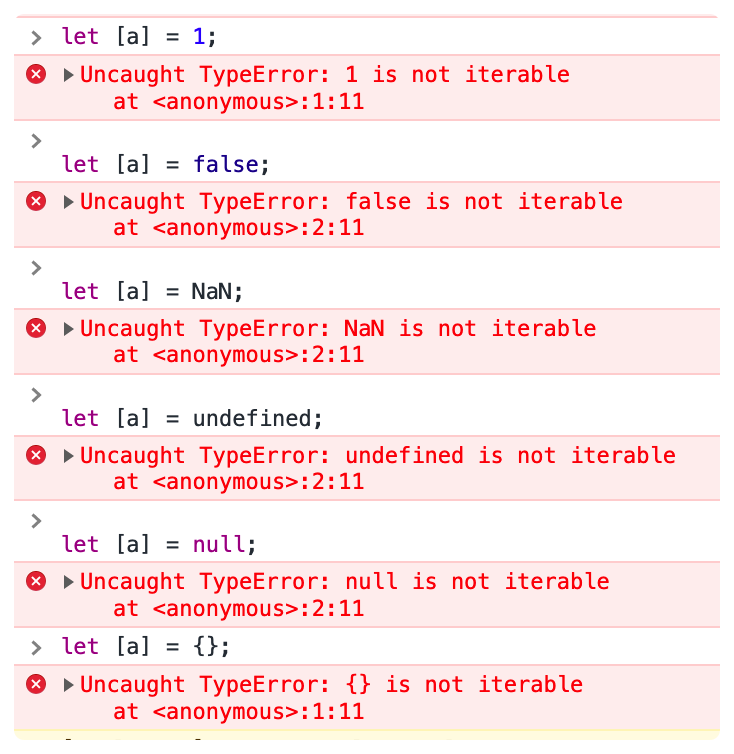

# JavaScript-es6 基础语法

ECMAScript 6.0（以下简称 ES6）是 JavaScript 语言的下一代标准，已经在 2015 年 6 月正式发布了。它的目标，使得 JavaScript 语言可以用来编写复杂的大型应用程序，成为企业级开发语言。

### 1、let

#### 1.1 特性一：代码块内有效

 在ES6中，新增了let关键字用来声明变量。用法类似于var，不过它所声明的变量，只在 **let关键字所在的代码块内有效**。

```javascript
{
    let a = 10;
    var b = 20;
}
console.log("输出a：" + a);
console.log("输出b：" + b);
```


以上代码中，a 因为是被let所修饰了，仅仅只在let所在的代码块中才会生效，所以在代码块外部去输出 a 时就会报错了：


**使用场景**

 根据let的特性，因此我们通常可以将let用在for循环等结构中：

```JavaScript
for (let i = 0; i < 10; i++) {
  console.log(i)
}
console.log(i) // 报错：Uncaught ReferenceError: i is not defined
```


如下案例：

```JavaScript
var array = [];
for (var i = 0; i < 10; i++) {
  array[i] = function() {
    console.log(i);
  }
}
array[2]();
```


以上代码中，因为循环变量 i 是用 var 声明的，可以理解为是全局的，全局中只有这一个 i。因此每一次循环， i 的值都会被改变。而在循环主体内数组 array 元素的函数内部的 console.log( i )中的 i 其实也就指向了 **全局的i**，相当于 **数组array 的所有成员里的i，都指向同一个i**。可以看出最后一轮循环结束，i 的值被修改为10，因此，此时数组里所有的 i 都是10了，所以最后控制台输出 10。

```JavaScript
var array = [];
for (let i = 0; i < 10; i++) {
  array[i] = function() {
    console.log(i);
  }
}
array[2]();
```


如果我们将 var 改成 let。那么此时的 i 只在**本轮循环中有效**，所以每一次循环的 i 其实都是一个重新声明的新变量，它们之间是没有任何关系互不关联的，所以最后输出的是 2。

> **Tips：**
>
> **既然每一轮循环的变量i都是重新声明的，那如何知道上一轮循环的值，从而计算出本轮循环的值？**
>
> 主要是由于 JavaScript 引擎内部会记录上一轮循环的值，初始化本轮的变量 i 时，就在上一轮循环的基础上进行计算。

#### 1.2 特性二：不能重复声明

如果我们使用 var 来定义变量，相同变量可以重复声明多次，而如果使用 let 来声明变量，那么 **如果使用 let 同一个变量只能声明一次**

```javascript
var b = 1;
var b = 11;
let a = 10;
let a = 20;
```


如下案例：


> **注意**
>
> 1. for 循环设置循环变量的区域是一个父作用域；
> 2. 循环体内部是一个单独的子作用域。
>
> ```JavaScript
> for (let i = 0; i < 10; i++) { // 父作用域
>  // 子作用域
>  let i = 'local'; // 此处虽然看似重复声明i，但是因为不是相同的作用域，所以不会报错
>  console.log(i);
> }
> // 输出10次 local
> ```
>
> 

#### 1.3 特性三：不允许变量提升

```JavaScript
console.log(msg);
var msg = "输出的信息";
```


 当我们使用 var 声明的变量 msg，可以在声明之前使用时，此时并不会报错，而会将该未声明的变量视为：`undefined`。 msg 因为是通过 var 声明的，所以 msg 发生了变量提升（hoisting）。相当于：

```javascript
var msg;
console.log(msg);
msg = "输出的信息";
```


**注意：只有声明被提升，初始化不会被提升，所以初始化保持在原地。**

**Tips：**

> **JavaScript 声明提升**
>
>  JavaScript中，函数及变量的声明都将被提升到函数的最顶部。

如果改成用 let 来声明：

```javascript
console.log(msg);
let msg = "输出的信息";
```


那么，此时在声明之前使用时就会报错。其实按照一般的编程逻辑，通常情况下变量需要在声明或定义之后才可以使用。因此，在 ES6 通过 let 就纠正这种现象，不允许变量提升。

#### 1.4 特性四：暂时性死区

 **暂时性死区（temporal dead zone，简称 TDZ）**：在块级作用域中只要是被 `let` 或 `const` 修饰的变量，就会被“绑定”（binding）在这个区域了，代码块会对这些被关键字声明的变量从块的开始就形成一个 **封闭作用域**。

那么，在该代码块内，一旦变量在声明之前被使用就会报错 。

```JavaScript
var tmp = 1;

if (true) {
  tmp = "全局变量"; // Cannot access 'tmp' before initialization
  let tmp;
}
```


在以上代码中，虽然 if 语句块之前已经定义了全局变量 tmp（第1行），但我们在 if 块级作用域内又用 let 声明了 tmp（第5行），那么就会导致 tmp 被绑定这个 if 块级作用域内。因此，在该块级作用域内所有对 tmp 的操作，都意味着是对局部变量 tmp 的操作（第5行）。而对tmp赋值（第4行）就相当于变量提升是不被允许的，所以就会报错。

### 2、const

#### 2.1 特性一：用来声明只读变量

 const 主要声明只读变量，在某些情况下等同于常量，声明之后不允许改变。const 保证变量指向的 **内存地址所保存的数据不允修改** ，因此如果通过 const 定义的基本类型（int float等）就等同于常量。

```javascript
const name = "Tim";
name = "Jack";
```


此处去修改一个常量name就报错了。

> **注意：**
>
> 常量需要在声明的时候就 **必须要赋值**，否则会报错。

```JavaScript
const name;
name = "Jack";
```


#### 2.2 特性二：块级作用域内有效

 作用域与 `let` 关键字相同，只在声明所在的块级作用域内有效。如下：

```JavaScript
{
    const a = 10;
}
console.log("输出：" + a);
```


> **注意：**
>
>  对于引用类型的数据（如对象或数组）而言，变量指向的内存地址，保存的只是一个指向实际数据的指针，`const` 只能保证这个指针是固定的（即总是指向另一个固定的地址），至于它指向的数据结构是不是可变的，就完全不能控制了。因此，将一个对象声明为常量必须非常小心。

#### 2.3 特性三：不能重复声明

#### 2.4 特征四：不允许变量提升

#### 2.5 特征五：暂时性死区

### 3、作用域规则

在ES5中，只有全局作用域和函数作用域，并没有块级作用域，因此我们在使用过程中，很容易会出现一些意想不到的情景。

我们来看以下这个例子：

```javascript
var date = new Date();

function operation(){
	console.log(date); // 输出时间
	if(false){
		var date = "0000";
	}
}
operation();
```


在上面这个例子中，最终运行的结果是`undefined`。

> 主要是由于函数外层定义了全局的date变量，而函数内部又通过var定义了date，此时就会引起变量提升，导致内层的date覆盖了外层的date。这样就会造成函数中`console.log(date);`这条语句输出date结果为undefined，因为此时在函数作用域内，这条语句之前只有date的声明，查找不到date的定义。

**因此在ES5中，很容易就会出现函数作用域覆盖了全局作用域；或者是循环中的变量泄露为全局变量的情况。**

实际上，我们在以上的代码中想要表达的是当不符合某些条件时才对date进行处理。由于没有块级作用域，导致全局变量污染。那么如果我们使用ES6中的let就可以避免此问题：

```javascript
var date = new Date();

function operation() {
	console.log(date);
	if(false) {
		let date = "这个是时间"; // 块级作用域有效
	}
}
operation();
// 输出了具体的时间：Tue Mar 03 2020 11:13:00 GMT+0800 (中国标准时间)
```


此时在 if 判断语句中的 date 因为被 let 定义，因此它的作用域就被限定在判断语句中了和外层的 date 互不影响。

**思考**

以下两个函数输出的结果分别是什么？

```javascript
function operation1() {
	var msg = "外层";
	
	if(true) {
		var msg = "内层"; 
	}
	console.log(msg);
}
operation1();


function operation2() {
	let msg = "外层";
	
	if(true) {
		let msg = "内层"; 
	}
	console.log(msg);
}
operation2();
```


结果：

> 内层
> 外层

#### 3.1 块级作用域

引入 let 后，实际上也给 JavaScript 新增了块级作用域的机制。那么**外层作用域无法获取到内层作用域，外层和内层即使都使用相同变量名，也都互不干扰，比较安全。**

```javascript
let c = 40;
{
	let a = 10;
	var b = 20;
	let c = 30;
}
console.log(a); // Uncaught ReferenceError: a is not defined
console.log(b); // 20
console.log(c); // 40
```


在ES6中，还允许块级作用域嵌套使用：

```javascript
{{{
	let a = 10;
	let b = 20;
	{let a = 100;}
	{{
		let b = 200;
		console.log(b);
	}}
	console.log(a);
}}}
```


输出结果：

> 200
> 10

#### 3.2 块级作用域中的函数声明

我们也可以在块级作用域中定义函数，定义出来的函数与使用let定义变量的效果是类似的，作用域限定在该块级作用域中，在块级作用域之外不可引用。

观察如下代码：

```javascript
function operation() {
	console.log("外层");
}
// 以下是一个自执行函数。自执行函数是一种常用的模式，用于创建一个新的作用域，以避免变量污染全局作用域。这个函数在定义后立即执行。
(function() {
  
	if(false) {
		function operation() {
			console.log("内层");
		}
	}
	operation();
}());
```


以上代码，如果在ES5中，会输出“内层”。因为在if中声明的operation函数被提升了，提升到函数顶部，即提升到了if上方，实际运行相当于以下代码：

```javascript
(function() {
	// 函数提升后
	function operation() {
		console.log("内层");
	}
	if(false) {
	}
	operation();
}());
```


**那么在ES6中，这个例子是不是会输出：“外层”呢？**

理论上是会输出“外层”。不过我们在支持ES6的浏览器中运行，此代码会报错：`Uncaught TypeError: operation is not a function`

为什么不是呢？主要是因为这样会对老代码产生很大影响的，所以为了减轻因此产生的不兼容问题，ES6 允许浏览器的实现可以不用去遵守以上规则，可以有自己的行为方式：

- 允许在块级作用域内声明函数。
- 函数声明类似于var，即会提升到全局作用域或函数作用域的头部。
- 同时，函数声明还会提升到所在的块级作用域的头部。

因此， **ES6 环境中，块级作用域内声明的函数，实际上还是类似于var声明的变量**。上面的案例实际运行的效果如下代码：

```javascript
function operation() {
	console.log("外层");
}
(function() {
	var operation; // if中的operation函数被提升
	if(false) {
		// 再次声明operation函数，此函数会被提升
		function operation() {
			console.log("内层");
		}
	}
	operation();
}());
```


因此就报错了：`Uncaught TypeError: operation is not a function`

> **总结**
>
>  考虑到浏览器环境问题，我们尽量避免在块级作用域中声明函数，如果需要，建议通过**函数表达式**来定义：

```javascript
function operation() {
	console.log("外层");
}
(function() {
	if(false) {
		// 通过函数表达式来定义函数
		let operation = function () {
			console.log("内层");
		}
	}
	operation();
}());
// 输出：外层				
```


#### 3.3 顶层对象属性

顶层对象，在浏览器环境下就是window对象，在 ES5 之中，顶层对象的属性与全局变量是等价的，所以我们给顶层对象的属性赋值就相当于给全局变量赋值。

```javascript
var a = 10;
console.log(window.a); // 10
	
a = 20
console.log(window.a); // 20
```


但是，在ES6中，顶层对象的属性将逐渐与全局变量脱钩，同时兼顾到兼容性，做了如下调整：

- **var** **function**命令声明的全局变量，仍然是**顶层对象的属性** （挂钩）
- **let** **const** **class**命令声明的全局变量，**不属于顶层对象的属性** （脱钩）

```javascript
var a = 10;
console.log(window.a);
	
let b = 20;
console.log(window.b); // undefined
const c = 30;
console.log(window.c); // undefined
```


##### 顶层对象（globalThis）

一般情况下，我们如果要获取顶层对象是通过 **this** 关键词来获取，不过顶层对象在不同环境下是不统一的。

> **注意：**
>
> 使用 **this** 去获取顶层对象存在一定的局限性，比如在Node 模块和 ES6 模块中，this 返回的的当前的模块，而不是顶层对象。

因此，我们可以使用引入的 **globalThis** 作为顶层对象。在任何环境下，`globalThis` 都是存在的，都可以通过获取到顶层对象，它是始终指向全局环境中的 this 的。

### 4、变量解构赋值

ES6 允许我们 按照一定的模式从数组或对象中去提取值，然后再对变量进行赋值，称为 **解构（Destructuring）赋值** 。

解构赋值本质上是对赋值运算符的扩展，是一种 **针对数组或者对象进行模式匹配** ，然后对其中的变量进行赋值的方式，能够更加方便我们对复杂对象的数据字段进行提取，代码简洁 可读性强 语义非常清晰。

解构赋值主要包含两部分：

**`解构目标 = 解构源`**

#### 4.1 数组模型解构

**按照顺序从左向右依次结构赋值**

```javascript
// 以前正常赋值
let nums = [1, 2, 3]
let a = nums[0]，b = nums[1]，c = nums[2];

// 解构赋值：从数组中提取值，然后对应位置给变量进行赋值。
let [a, b, c] = [1, 2, 3]
```


只要等号两边的模式相同，那么左边的变量就会被赋予对应的值。

如下：

```javascript
// 嵌套
let [foo, [[bar], baz]] = [1, [[2], 3]];
// foo = 1
// bar = 2
// baz = 3

// 可忽略
let [ , , third] = ["foo", "bar", "baz"];
// third = "baz"

let [x, , y] = [1, 2, 3];
// x = 1
// y = 3

let [x, y, ...z] = ['a'];
// x = "a"
// y = undefined
// z = []

// 剩余运算符
let [head, ...tail] = [1, 2, 3, 4];
// head = 1
// tail = [2, 3, 4]

// 不完全解构
let [x, y] = [1, 2, 3];
// x = 1
// y = 2

let [a, [b], d] = [1, [2, 3], 4];
// a = 1
// b = 2
// d = 4

// 解构默认值：当解构模式有匹配结果，且匹配结果是 undefined 时，会触发默认值作为返回结果。
let [a = 2] = [undefined]; 
// a = 2
let [a, b = -1] = [10];
// b = -1

let [a = 3, b = a] = [];     
// a = 3, b = 3
let [a = 3, b = a] = [1];    
// a = 1, b = 1
let [a = 3, b = a] = [1, 2]; 
// a = 1, b = 2
```


> **注意：**
> 如果解构源（等号的右边）不是集合（即不是可遍历的结构），那么解构时就会报错。
>
> 

```javascript
// 如下都会报错：
let [a] = 1;
let [a] = false;
let [a] = NaN;
let [a] = undefined;
let [a] = null;
let [a] = {};
```



**思考**

x 和 y 的结果是什么？

```javascript
  let [x = y, y = 1] = []; 
```


结果：报错 Cannot access 'y' before initialization

#### 4.2 对象模型解构

数组解构方式和对象解构类似，不过需要注意的是数组的元素是按次序排列的，按照次序来进行解构，变量的取值由它所在的位置决定的。**对象的解构匹配的是属性，并没有没有次序要求，属性是匹配的模式**。

**场景一：解构目标的变量名和属性名相等**

**`保证变量名和解构源对象的属性名称相等，那么就可以解构赋值成功`**

```javascript
let { foo, bar } = { foo: 'aaa', bar: 'bbb' };
// foo = "aaa"  
// bar = "bbb"

// 以上左边的解构目标， { foo, bar }， 则意味着属性名和变量名相等，相当于 { foo: foo, bar: bar }
// 所以变量foo的赋值过程是在解构源中先找到名为foo的属性的值（aaa），然后再将值赋值给变量foo，bar变量也同理。

let { baz } = { foo: 'aaa', bar: 'bbb' };
// baz = undefined
```


**场景二：解构目标变量名和属性名不相等**

再看以下例子，变量名和属性名不相等时：

```javascript
let { foo: i, bar: j } = { foo: 'aaa', bar: 'bbb' };

console.log(foo) // Uncaught ReferenceError: foo is not defined
console.log(i) // aaa
console.log(j) // bbb
```


以上代码在解构赋值时，是先找到同名属性（ `foo` 和 `bar` ），然后再将值 `aaa` 赋给对应的变量 `i` ；将值 `bbb` 赋值给变量 `j` ，所以真正被赋值的其实是变量 `i` 和 `j` ，而不是属性。

##### 4.2.1 嵌套结构对象的解构

```javascript
let {key: [x, {y}]} = {key: ['Hello', {y: 'World'}]}
console.log(x) // "Hello"
console.log(y) // "World"
```


此时的 key 并不是我们要赋值的变量，它只是我们用来匹配的模式，如果我们需要用key当做被赋值的变量，那么可以这样写：

```javascript
let {key, key: [x, {y}]} = {key: ['Hello', {y: 'World'}]}
console.log(x) // "Hello"
console.log(y) // "World"
console.log(key) // ['Hello', {y: 'World'}]
```


> **注意**
> 如果我们想要将已经定义的变量进行解构赋值，那么需要 **用 `( )` 将整个解构赋值语句包裹起来** :

```javascript
let x;
{x} = {x: 1};
// SyntaxError: syntax error
```


报错主要是因为 JavaScript 引擎会将 `{x}` 理解成是一个代码块，就发生语法错误 。只有不将大括号写在行首，避免 JavaScript 将其解释为代码块，才能解决这个问题。

> 改成如下代码：

```javascript
let x;
({x} = {x: 1});
```


再看以下案例：

```javascript
let obj = {};
let arr = [];

({ foo: obj.prop, bar: arr[0] } = { foo: 123, bar: true });
console.log(obj) // {prop: 123}
console.log(arr) // [true]
```


- 第一次匹配，匹配的模式是 `foo`，解构的地方是`obj.prop = 123`，则 `obj = {prop: 123}`
- 第二次匹配，匹配的模式是 `bar`，解构的地方是`arr[0] = true`，则 `arr = [true]`

##### 4.2.2 对象中默认值的解构

```javascript
var {x = 3} = {};
x // 3

var {x, y = 5} = {x: 1};
x // 1
y // 5

var {x: y = 3} = {};
y // 3

var {x: y = 3} = {x: 5};
y // 5

var { message: msg = 'Something went wrong' } = {};
msg // "Something went wrong"
```


**注意**

> 在对象默认值匹配过程中，我们需要注意默认值生效的条件是：**对象属性的值严格等于undefined**。

```javascript
var {x = 3} = {x: undefined};
x // 3

var {x = 3} = {x: null};
x // null
```


#### 4.3 将数组当作对象来解构

```javascript
let arr = [1, 2, 3];
//  [1, 2, 3] 可当成 {0: 1, 1: 2, 2: 3}
let {0 : first, [arr.length - 1] : last} = arr;
console.log(first); // 1
console.log(last); // 3 第二个解构中的[arr.length - 1]相当于2键，所对应的值是3
```


### 5、字符串扩展

#### 5.1 Unicode表示字符

在ES6中，加强了字符串对Unicode字符的表示，我们可以通过 `\uxxxx` 形式去表示一个字符，其中 `xxxx` 是字符的 Unicode 码点。

```javascript
console.log("\u0061"); // a
console.log("\u0062"); // b
```


不过，这种表示法仅限于码点在 `\u0000` ~ `\uFFFF` 之间的字符，一旦超出这个范围的字符，必须用两个双字节的形式来表示:

```javascript
console.log("\uD842\uDFB7"); // 𠮷
```


因此ES6给我们提供了另外一种，表示方法: **\u { xxxx }** 。 只要我们将码点放入括号中即可正确解读字符了。

```javascript
console.log("\u{20BB7}") // 𠮷
console.log("\u{0061}"); // a
console.log("\u{0062}"); // b
```


我们在使用字符串时，可以直接输入字符或者是输入字符的Unicode转义形式，如下我们直接输入字符 `中` 和输入它的Unicode转义形式 `\u4e2d` 都表示的是：中

```javascript
if('中' === '\u{4e2d}'){
    console.log(true)
}
// true
```


不过以下几种情况是不能输入字符，**只能以转义形式输入或者用Unicode字符**：

- U+005C：反斜杠（reverse solidus)
- U+000D：回车（carriage return）
- U+2028：行分隔符（line separator）
- U+2029：段分隔符（paragraph separator）
- U+000A：换行符（line feed）

比如反斜杠，不能直接在字符串里面输入 `\` ，一定要转义写成 `\\` 或者 `\u{005c}`

#### 5.2 字符串遍历接口

在 ES6 中，也为字符串扩展了遍历器接口，我们可以通过 `for-of` 语句来实现字符串的遍历。

```javascript
for (let c of "JavaScript") {
	console.log(c);
}
```


我们使用传统的for循环也可以遍历字符串：

```javascript
let text = "Hello";
for(let i = 0; i < text.length; i++) {
	console.log(text[i]);
}
```


不过需要注意的是对于由Unicode码点表示的并且大于 `0xFFFF` 的码点，传统for循环无法识别的，就**必须要使用`for-of`来遍历**：

```javascript
let text = String.fromCodePoint(0x20BB7);

for (let i = 0; i < text.length; i++) {
  console.log(text[i]);
}
// �
// �

for (let i of text) {
  console.log(i);
}
// 𠮷
```


#### 5.3 JSON.stringify() 的扩展

在JavaScript中，对于JSON数据的操作，通常会用到以下两个方法

- 使用 `JSON.stringify()`方法来将 JavaScript 对象转换为 JSON 字符串；
- 使用`JSON.parse()` 方法将 JSON 字符串转为 JavaScript 对象。

```javascript
let obj = {name: "Jerry", password: "123qwe"};
let jsonObj = JSON.stringify(obj);
console.log(jsonObj); //  {"name":"Jerry","password":"123qwe"}
console.log(JSON.parse(jsonObj)); // object
```


根据JSON标准，**JSON 数据必须是 UTF-8 编码格式** 。而UTF-8 标准又规定了`0xD800` 到 `0xDFFF` 之间的码点不能单独使用，必须配对使用。

因此在使用 `JSON.stringify()` 方法时有可能会出现获取到是不符合 UTF-8 标准的字符串。比如返回单个码点，或者不存在的形式。

因此，ES6 就扩展了 `JSON.stringify()` 方法的处理行为，在遇到`0xD800` 到 `0xDFFF` 之间的单个码点或者不存在的配对形式时，它会 **返回转义字符串**，留给应用自己决定下一步的处理。

```javascript
console.log(JSON.stringify('\u{D834}')); // "\ud834"
```


#### 5.4 模板字符串

以前我们在页面元素中，需要在字符串中插入一些变量并展示：


```html
<!DOCTYPE html>
<html lang="en">
<head>
    <meta charset="UTF-8">
    <title>Document</title>
    <script src='https://cdnjs.cloudflare.com/ajax/libs/jquery/3.6.0/jquery.js'></script>
</head>
<body>
    <button onclick="count()">统计</button>
    <div id="result"></div>
    <script>
        function count() {
            let basket = {count: 17, onSale: 21}
            $('#result').html(
                /* 字符串模版 */
                'There are <b>' + basket.count + '</b> ' +
                'items in your basket, ' +
                '<b>' + basket.onSale +
                '</b> are on sale!'
            );
        }
    </script>
</body>
</html>
```


那么，如果我们通过ES6提供的模板字符串，就可以很简单的完成字符串模版的定义。

**模板字符串**（template string）是增强版的字符串，通过反引号 **`** 定义 ：

```javascript
$('#result').html(`
    There are <b> ${basket.count} </b>
    items in your basket,
    <b> ${ basket.onSale } </b>
    are on sale!
`);
```


##### 5.4.1 嵌入变量

在模版中，如果需要插入HTML标签则可以直接添加，如果我们需要在文本中插入变量，则可以使用 **`$ { }`** 来嵌入，也可以嵌入表达式，调用函数等。不过也可以直接嵌入字符串字面量

```javascript
console.log(`Hello ${"World"}`); // Hello Wrold
```


> **注意**：
> 但是如果嵌入的变量未声明，那么就会报错
>
> ```javascript
> console.log(`Hello ${msg}`);  
> // Uncaught ReferenceError: msg is not defined
> ```
>
> 

### 6、函数扩展

#### 6.1 参数默认值

在 ES6 中允许为函数的参数设置相应默认值，直接将默认值写在参数定义的后面即可：

```javascript
function getProfile(name, age = 17) {
	console.log(`姓名：${name}, 年龄：${age}`);
}
getProfile("Jack"); // 姓名：Jack, 年龄：17
getProfile("Tom", ""); // 姓名：Tom, 年龄：
getProfile("Lee", 27); // 姓名：Lee, 年龄：27
getProfile("Ben", null); // 姓名：Ben, 年龄：null
```


> **注意**
>
> 1. 只有在**未传参**，或者参数为 **undefined** 时，才会使用默认参数，如果传的是 null 则也会被认为是有效的值传递。
> 2. 使用函数默认参数时，不允许有同名参数，如： `getProfile(name, name)`
> 3. 函数参数默认值存在暂时性死区，在函数参数默认值表达式中，未初始化赋值的参数值无法作为其他参数的默认值，如：
>
> ```javascript
> function getProfile(x = y){}
> getProfile();
> ```
>
> 


我们还可以这样使用：

```javascript
function Size(w = 0, h = 0) {
	this.w = w;
	this.h = h;
}

const size = new Size();
console.log(size); 
size.w = 10;
size.h = 10;
console.log(size); 
```


> **注意**
> 参数变量是默认声明的，因此，我们不能用`let`或`const`再次声明：

```javascript
function Size(w = 5) {
    let w = 1; // Uncaught SyntaxError: Identifier 'w' has already been declared
    const w = 2; // Uncaught SyntaxError: Identifier 'w' has already been declared
}
```


#### 6.2 rest 参数（不定参数）

 在传参过程中，我们可以使用rest 参数（不定参数），可以让我们传入任意数量的参数，参数的格式为：`...变量名` 。

```javascript
function getNums(...nums){
    console.log(nums.length);
}
getNums(1, 2, 3, 4, 5); // 5
getNums(10); // 1
```


再看这个例子：

```javascript
function getNums(x, y, ...nums){
    console.log(nums.length);
}
getNums(1, 2, 3, 4, 5); // 5
getNums(); // 0
```


又如：

```javascript
function getSum(...nums){
  let sum = 0;
	for (let n of nums) {
		sum += n;
	}
    return sum;
}
console.log(getSum(1, 2, 3, 4, 5)); // 15
```


> 注意：
> ​ 不定参数只能在参数序列的最末尾，否则会报错：Uncaught SyntaxError: Rest parameter must be last formal parameter
>
> 以下两种方式都会报错：

```javascript
function getNums(x, ...nums, y)
function getNums(...nums, x)
```


#### 6.3 箭头函数

 箭头函数提供了一种更加简洁的函数书写方式。基本语法是：`(参数列表) => 函数体` ：

```javascript
// 普通函数表达式
let func = function(v) {
	console.log(v);
}

// 箭头函数表达式
let func = v => console.log(v);
```


箭头函数可以使代码更加整洁易懂：

```javascript
const isEven = n => n % 2 === 0;
const square = n => n * n;

console.log(isEven(11)); // false
console.log(square(9)); // 81
```


使用sort完成数组排序：

```javascript
let nums = [13, 73, 26, 6, 63, 83, 36];
nums.sort((a, b) => a - b); // 升序排列， 降序则 b - a
console.log(nums); // [6, 13, 26, 36, 63, 73, 83]
```


**注意：**

- 1）如果箭头函数**没有参数**或者有**多个参数**时，参数列表**需要使用括号** `()` 包裹起来：

```javascript
// 无参数
let func = () => console.log("无参数");
func();

// 多个参数
let func = (a, b) => a + b;
console.log(func("多个", "参数"));
```


- 2）如果**函数体中不止一条语句**，就 **需要使用大括号**`{}`将它们括起来：

```javascript
let func = (a, b) => {
	console.log("加法运算");
	return a + b;
};
console.log(func(10, 10));
```


- 3）当箭头函数函数体只有一条语句，且需要**返回对象**时，**该对象需要使用括号** `()` 包裹起来，主要是为了和函数体的（`{ }`）区分开：

```javascript
let func = (n, p) => {name: n, password: p};
console.log(func("Henry", "123qwe")); // Uncaught SyntaxError: Unexpected token ':'
```


改成：

```javascript
let func = (n, p) => ({name: n, password: p});
console.log(func("Henry", "123qwe"));
```


或者

```javascript
let func = (n, p) => {return {name: n, password: p};};
console.log(func("Henry", "123qwe"));
```


- 4）箭头函数体内的 this ，是**定义时所在作用域的this**，而不是调用时的对象。
- 5）不可以当作构造函数，即不能使用 new 命令，否则会抛出一个错误。
- 6）无法使用 `arguments` 对象，该对象在箭头函数体内不存在。如果需使用，则建议用 `rest` 参数代替。

#### 6.4 name属性

我们可以使用函数的`name`属性来返回该函数的函数名。

```javascript
function getProfile(age = 17) {
    console.log(`年龄：${age}`);
}
console.log(getProfile.name); // 函数声明：getProfile
	
let func = v => console.log(v);
console.log(func.name); // 函数表达式：变量名func
	
let newFunc = function operation(){};
console.log(newFunc.name); // operation 。特别注意，此时并不是newFunc
```


### 7、数组扩展

#### 7.1 运算符扩展

**扩展运算符 `...`**

- *将数组转化为参数序列*

 通过扩展运算符 `...`（三个点），我们可以将一个**数组转化为用逗号分隔的参数序列**。

```javascript
console.log(...[1, 2, 3])
// 1 2 3

console.log(1, ...[2, 3, 4], 5)
// 1 2 3 4 5

[...document.querySelectorAll('div')]
// [<div>, <div>, <div>]
```


应用场景：

```javascript
// 未使用扩展运算符
function getSum(a, b) {
  return a + b;
}
const numbers = [2, 1];
console.log(getSum(numbers[0], numbers[1]));
```


扩展运算符可以用在**函数调用中**：

```javascript
// 使用了扩展运算符
function getSum(a, b) {
    return a + b;
}
const numbers = [2, 1];
console.log(getSum(...numbers));
```


以上代码中， 调用getSum函数时对参数 numbers 使用了扩展运算符，那么会将该数组转化为参数序列 `2 1`，并且将参数序列分别赋值给a，b，然后再进行求和返回。

- *扩展运算符与函数参数结合使用*

如下，和参数一起使用：

```javascript
function operation(a, b, c, d, e) {
	console.log(a); // -7
	console.log(b); // 8
	console.log(c); // 1
	console.log(d); // msg
	console.log(e); // true
}
const args = [8, 1];
operation(-7, ...args, "msg", ...[true, 21]);
```


再看下面的例子：

```javascript
function push(array, ...elems){
	array.push(...elems);
}
let nums = [10, 20, 40, 24];
push(nums, ...[1]);
console.log(nums); // [10, 20, 40, 24, 1]
push(nums, ...["张三", "李四", "王五", "赵六"]);  // [10, 20, 40, 24, 1, "张三", "李四", "王五", "赵六"]
console.log(nums);
```


以上代码，通过扩展运算符，可以数组转化成参数序列后添加进新的数组中（即合并数组）。

- *扩展运算符后面可以跟表达式*

如下案例，在扩展运算符后面跟上了三元运算符。

```javascript
function push(array, ...elems){
	array.push(...elems);
}
let nums = [10, 20, 40, 24];
const x = 10;
push(nums, ...(x > 0 ? [1, 2, 3, 4]: [ -1, -2, -3, -4]));
console.log(nums);
// x=10 ：[10, 20, 40, 24, 1, 2, 3, 4]
// x=-10：[10, 20, 40, 24, -1, -2, -3, -4]
```


**注意：**

> 1. 如果我们直接在括号中放入扩展运算符，则会直接报错，如下代码，会报错：
>
> ```javascript
> (...[1, 2]); // Uncaught SyntaxError: Unexpected token '...'
> ```
>
> 

**扩展运算符的应用**

##### 7.1.1 数组克隆

 在JavaScript中，数组是引用类型，那么我们如果去拷贝数组，使用常规赋值的方式，其实拷贝的只是数组的指针，因此，共享同一块内存，所以任何一方的修改都会影响到另一方：

```javascript
const a1 = [10, 20, 30];
const a2 = a1;
 	
a1[0] = -1; // 将a1的第一个元素修改了
console.log(a2); // [-1, 20, 30]  a2 中的第一个元素也受到影响
```


***如何去克隆一个元素和原数组一样并且不是共享同一个内存的数组呢？***

- 在ES5中，可以通过`concat()`方法来克隆一个全新的数组：`const a2 = a1.concat();`
- 在ES6中，我们可以直接用扩展运算符来实现克隆：

```javascript
const a1 = [10, 20, 30];
const a2 = [...a1]; // 将通过扩展运算符将a1的所有元素转化成参数序列再放入新的数组中
	
a1[0] = -1; 
console.log(a2); // [10, 20, 30]  a2与a1是两个完全不同的数组
```


##### 7.1.2 数组合并

 在ES5中，如果我们需要合并数组，仍然是使用 `concat()` 方法来实现，`concat()` 方法最后会返回合并后的 **新数组**：

```javascript
const a1 = [1, 2, 3];
const a2 = [4, 5, 6];
const a3 = ['a', 'b', 'c'];
let arr = a1.concat(a2, a3);
console.log(arr); // [1, 2, 3, 4, 5, 6, 'a', 'b', 'c'];
```


通过ES6，我们也可以通过数组的扩展运算符 `...` 来完成数组的合并：

```javascript
const a1 = [1, 2, 3];
const a2 = [4, 5, 6];
const a3 = ['a', 'b', 'c'];
let arr = [...a1, ...a2, ...a3];
console.log(arr); // [1, 2, 3, 4, 5, 6, 'a', 'b', 'c'];
```


##### 7.1.3 字符串转换数组

 我们还可以使用扩展运算符将字符串转为数组。

```javascript
let strArr = [...'Hello'];
console.log(strArr);
// ["H", "e", "l", "l", "o"]
```


#### 7.2 对象转数组

##### 7.2.1 Array.from( )

 在ES6中，有一些对象是可以转化成数组的，可以通过 `Array.from()` 方法来实现。

那么，要求对象支持以下其中的一个特性即可：

- 类似数组的对象（array-like object）
- 可遍历（iterable）的对象

***类似数组的对象***

如下案例：

```javascript
let arrayLike = {
    '0': 'a',
    '1': 'b',
    '2': 'c',
    length: 3
};

// ES6的写法
let arr2 = Array.from(arrayLike); 
// ['a', 'b', 'c']

// ES5的写法
var arr1 = [].slice.call(arrayLike); 
// ['a', 'b', 'c']
```


**那么都有哪些对象可以转化为数组？**

- 1）函数中的 `arguments` 对象

  `arguments` 对象是函数中的对象，封装了函数的实参以及实参个数。 `arguments` 不能被显式创建， `arguments` 对象只有函数开始时才可用。

```javascript
function getSum(a, b, c) {
	console.log(typeof arguments); // object
	console.log(arguments); // {0: 10, 1: 20, 2: 30, length: 2}
	console.log(Array.from(arguments)); // [10, 20, 30]
	return a + b + c;
}
getSum(10, 20, 30);
```


打印的`arguments` 对象：


- 2）DOM 操作返回的 `NodeList` 集合

  `querySelectorAll()` 方法可以返回文档中指定选择器的**所有元素**，返回的是 `NodeList` 对象。

```html
<!DOCTYPE html>
<html>

	<head>
		<meta charset="utf-8" />
		<title></title>
	</head>
	<script src="https://ajax.aspnetcdn.com/ajax/jQuery/jquery-3.3.1.js"></script>

	<body>
		<div id="div1">
			第一个Div
		</div>
		<div id="div2">
			第二个Div
		</div>
		<script type="text/javascript">
			let allDiv = document.querySelectorAll("div")
			console.log(allDiv); // NodeList(2)
			console.log(Array.from(allDiv)) // Array(2)
		</script>
	</body>

</html>
```


结果如下：


以上的两类对象除了可以使用 Array.from 来转为数组以外，还可以使用扩展运算符来转化：

```javascript
function getSum(a, b, c) {
    console.log(typeof arguments); // object
    console.log(arguments); // {0: 10, 1: 20, 2: 30, length: 2}
    console.log([...arguments]); // [10, 20, 30]
    return a + b + c;
}
getSum(10, 20, 30);

let allDiv = document.querySelectorAll("div")
console.log([...allDiv]); // Array(2)
```


#### 7.3 数组元素查找

##### 7.3.1 find()

 通过数组的 `find()` 方法，可以找出数组中**第一个符合条件的元素**。

如下，查找数组中大于60的第一个元素：

```javascript
let tar = [52, 23, 64, 58, 74, 40].find(x => x > 60);
console.log(tar); // 64
```


函数接受两个参数，函数原型如下：

```
find(function(currentValue, index, arr),thisValue)
```

1. 参数一：必需。 `function(currentValue, index, arr)` ，其中currentValue为当前值，index为当前索引，arr为当前数组。
2. 参数二：可选。用来规定回调函数中this所指向的对象。

```javascript
let tar = [52, 23, 64, 58, 74, 40].find(function(value, index, arr) {
	return value > 60;
})
console.log(tar); // 64
```


> **注意**
>
> - 如果找不到符合条件的成员，则返回**undefined**。
> - 如果是空数组，则该函数不会执行。

第二个参数，用来绑定回调函数的this对象。如下：

```javascript
// 查找比张三分数高的分数
let student = {sno: "s2017312309", name: "张三", score: 72}
// 回调函数
function test(s){ // s是数组中被检查的元素
	return s > this.score; // this指向find()方法中的第二个参数，即student
}
let result = [52, 23, 64, 58, 74, 40].find(test, student);
console.log(result); // 74
```


##### 7.3.2 findIndex()

 通过数组的 `findIndex()` 方法，可以找出数组中**第一个符合条件的元素索引**。用法与 `find()` 类似。

```javascript
let tIndex = [52, 23, 64, 58, 74, 40].findIndex(x => x > 60);
console.log(tIndex); // 2

let tIndex = [52, 23, 64, 58, 74, 40].findIndex(function(value, index, arr){
	return value > 60;
})
console.log(tIndex); // 2
```


> **注意**
>
> 如果找不到符合条件的成员，则返回 **-1**。

##### 7.3.3 filter()

过滤数组元素，该方法创建一个新的数组，新数组中的元素是通过检查指定数组中符合条件的所有元素

```javascript
let tar = [52, 23, 64, 58, 74, 40].filter(x => x > 60); 
console.log(tar); // [64, 74]
```


##### 7.3.4 includes()

 判断数组中是否包含某元素：

```javascript
console.log([1, 2, 3].includes(2))     // true
console.log([1, 2, 3].includes(4))     // false
console.log([1, 2, NaN].includes(NaN)) // true
```


### 8、对象的扩展

#### 8.1 简写属性

##### 8.1.1 属性的简洁表示

在ES6中，对象的属性和方法，直接在花括号中添加变量和函数即可。

```javascript
// ES5
var student1 = {
    name: "Jack"
};
console.log(student1);

// ES6
var name = "Jack";
var student = {name};
console.log(student);
```


在以上的代码中，ES6的方式是定义了一个变量name，赋值为“Jack”， 然后我们将name直接写入花括号中，那么，此时name就被当作对象的属性了，它的值就是属性对应的值。

当我们在函数内，将返回的值写入花括号时，最后返回的值也会被封装到对象中，形式参数是对象的属性，实际参数是属性对应的值，如下：

```javascript
let size = function(w, h){
		return {w, h}
}
console.log(size(10, 20));
```


#### 8.2 简写方法

##### 8.2.1 方法的简洁表示

在花括号中，直接写入方法，那么方法名就是对象的方法名，方法内容就是所对应的内容

```javascript
// ES6
var name = "Jack";
var student = {
    name,
    showProfile(){
        console.log("方法的简洁表示");
    }
};
console.log(student);
```


以上写法相当于：

```javascript
// ES6
var name = "Jack";
var student = {
    name,
    showProfile: function(){
        console.log("方法的简洁表示");
    }
};
console.log(student);
```


#### 8.3 对象的简洁表示

我们定义对象时，可以简写对象的属性和对象的方法：

```javascript
let name = "Jack";
let stuno = "stu100012031";
let sexual = 1;
let student = {
	name, // 相当于 name: name
	stuno, // 相当于 stuno: stuno
	sexual, // 相当于 sexual: sexual
	showProfile(){
		console.log(`姓名: ${name}, 学号: ${stuno}, 性别: ${sexual}`);
	}
};
student.showProfile(); // 姓名: Jack, 学号: stu100012031, 性别: 1
```


那么，对于对象的简洁表示，我们在函数内返回对象时就非常实用了：

```javascript
function getModel(name, stuno, sexual) {
    return {
        name,
        stuno,
        sexual,
        showProfile() {
            console.log(`姓名: ${name}, 学号: ${stuno}, 性别: ${sexual}`);
        }
    }
}
let student = getModel("Jack", "stu100012031", 0);
console.log(student);
```


也可以嵌套使用：

```javascript
function getModel(name, stuno, sexual) {
	return {
		name,
		stuno,
		sexual,
		showProfile() {
			console.log(`姓名: ${name}, 学号: ${stuno}, 性别: ${sexual}`);
		}
	}
}
let student = getModel("Jack", "stu100012031", 0);
let tName = "Teacher Wang";
let tNo = "t20200343001";
let teacher = {tName, tNo};
console.log({student, teacher});
```


通过这种方式可以让代码的可读性更高了。大家可以看到，输出的对象前面有对应属性名，就是内层对象的名字，代码就很清晰了。

#### 8.4 属性名表达式

在 ES6 中我们使用（表达式）作为对象的属性名，即把 **表达式放在方括号** 内：

```javascript
// 表达式属性名
let name = "Jack";
let stuno = "stu100012031";
let sexual = 1;
let student = {
    name, // 相当于 name: name
    stuno, // 相当于 stuno: stuno
    sexual, // 相当于 sexual: sexual
    showProfile() {
        console.log(`姓名: ${name}, 学号: ${stuno}, 性别: ${sexual}`);
    }
};
console.log(student["stuno"]); // stu100012031
console.log(student["stu" + "no"]); // stu100012031
```


我们再看下面的例子：

```javascript
let stuno = "stunumber";
let student = {
    name: "Jack",
    [stuno]: "stu100012031", // 等同于 ["stu" + "number"]: "stu100012031"
    showProfile() {
        console.log(`姓名: ${name}, 学号: ${stuno}`);
    }
};
console.log(student["stunumber"]);
console.log(student["stu" + "number"]);
console.log(student[stuno]);
console.log(student.stunumber);
```


以上代码可以看出，如果需要通过表达式来操作属性值，只需要放在方括号中即可。

#### 8.5 方法名表达式

在定义对象时，对于方法名也可以使用表达式：

```javascript
let stuno = "stunumber";
let info = "showprofile";
let student = {
    name: "Jack",
    [stuno]: "stu100012031", // 这里等同于 ["stu" + "number"]: "stu100012031"
    ["show" + "profile"]() { // 这里等同于 ["show" + "profile"]()
        console.log(`姓名: ${this.name}, 学号: ${stuno}`);
    }
};
student["showprofile"]();
student["show" + "profile"]();
student[info]();
student.showprofile();
```


**注意**

1 属性名表达式如果这样和属性简写一起混用时则会报错：

```javascript
let age = 'value';
let student = {[age]}; // Uncaught SyntaxError: Unexpected token '}'
```


建议改成：

```javascript
let age = 'value';
let student = {[age]: 17};
```


当然，这种方式显然很麻烦，一般不建议使用。

2 如果属性名表达式是对象时，都会被默认转为字符串 `[object Object]`，那么如果有多个属性都使用了对象表达式，则就会出现最后一个覆盖前面的情况：

```javascript
let proA = {a: 1};
let proB = {b: 2};
let object = {
  [proA]: 'A',
  [proB]: 'B'
};
console.log(object); // Object {[object Object]: "B"}
```


以上代码中，因为属性`proA`和`proB`都使用了对象表达式作为属性名，因此这两个表达式都被转为了`[object Object]`，因为是相同的key，所以后面key的值就会覆盖前面的值。

#### 8.6 对象的扩展运算符

**对象的扩展运算符：`...`**

##### 8.6.1 解构赋值

我们也可以使用扩展运算符来完成对象的解构赋值。

对象的解构赋值主要用来把保存在对象中的值取出来，相当于将目标对象自身的所有可遍历的（enumerable） 但尚未被读取的属性，分配到指定对象上。所以**对象中的所有键和对应的值，都会拷贝到新对象上面**。

```javascript
let { name, age, ...r } = { name: 'Ben', age: 10, sexual: 1, stuno: 's20201323' };
console.log(name) // Ben
console.log(age) // 10
console.log(r) // {sexual: 1, stuno: "s20201323"}
```


以上代码中，`r` 是一个需要解构赋值的对象，因此会从右边的解构源中，将剩余尚未读取的键（sexual stuno）和值一起拷贝到新对象中。

再看下面的例子：

```javascript
let { name, age, ...r } = { name: 'Ben', age: 10 };
console.log(name) // Ben
console.log(age) // 10
console.log(r) // {}
```


**注意**

1）在解构赋值过程中，要求解构源（在等号右边）必须是一个对象，因此如果**解构源是 `undefined` 或 `null`** ，**代码就会报错**，因为它们无法转为对象。

```javascript
let { name, age, ...r } = null; 
// Uncaught TypeError: Cannot destructure property 'name' of 'null' as it is null.

let { name, age, ...r } = undefined; 
// Uncaught TypeError: Cannot destructure property 'name' of 'undefined' as it is undefined.
```


2）使用扩展运算符进行解构赋值的对象必须是 **最后一个参数**，否则会报错：

```javascript
let { name, ...r age } = { name: 'Ben', age: 10, sexual: 1, stuno: 's20201323' };
// Uncaught SyntaxError: Rest element must be last element

let { ...r, name, age } = { name: 'Ben', age: 10, sexual: 1, stuno: 's20201323' };
// Uncaught SyntaxError: Rest element must be last element
```


3）解构赋值的是浅拷贝（指针拷贝），即如果对象中的键对应的值是引用类型（数组 对象 函数），那么解构赋值拷贝的其实是这个 **值的引用** 。

```javascript
let course = {cname: "web", credit: 3};
let { name, age, ...r } = { name: 'Ben', age: 10, sexual: 1, stuno: 's20201323', major: course};
r.major.credit = 4
console.log(course.credit); // 4
```


以上代码中，解构源中，`major`所对应的值是一个对象，那么在解构完`r`之后，`r`中的`major`属性所对应的值是`course`的引用。因此，我们对`r`中的`major`的`credit`属性进行修改时也会影响到`course`的`credit`属性。

##### 8.6.2 通过运算符转对象

###### 数组转对象

数组其实可以看成是特殊的对象，因此也可以通过扩展运算符来将数组转化成对象：

```javascript
let obj = {...[10010, "联通", true]};
console.log(obj); // {0: 10010, 1: "联通", 2: true}
```


###### 其他情况

我们在使用扩展运算过程中，如果运算符后面不是对象，则会自动将其转为对象：

```javascript
console.log({..."Hello"}); // {0: "H", 1: "e", 2: "l", 3: "l", 4: "o"}

console.log({...true}); // {}

console.log({...7}); // {}
```


##### 8.6.3 合并对象

与数组一样，也可以通过扩展运算符来合并对象：

```javascript
let obj1 = { name: 'Ben', age: 10 };
let obj2 = { sexual: 1, stuno: 's20201323' };
let student = {...obj1, ...obj2};
console.log(student); // {name: "Ben", age: 10, sexual: 1, stuno: "s20201323"}
```


#### 8.7 链判断运算符（`?.`）

在某些场景下，我们有时需要读取对象内部的某个属性，往往需要判断一下该对象是否存在，这样一层一层判断，例如读取`response.content.user.account`，常规的写法如下样：

```javascript
let response = {
    status: 10001,
    message: "请求成功!",
    content: {
        user: {
            account: "u1001",
            password: "001"
        }
    }
};
const account = (response && response.content && response.content.user && response.content.user.account) || 'default';

console.log(account); // u1001
```


不过可以看得出，这样判代码量多，比较麻烦，那么在ES6中，可以使用链判断运算符（optional chaining operator）来实现：

```javascript
const account = (response?.content ?.user ?.account || 'default');
console.log(account); // u1001
```


链判断运算符`?.`会直接在链式调用的时候进行判断，**判断左侧**的对象**是否为 `null` 或`undefined`**。如果是的话就不会往下运算，而是直接返回 `undefined`。