# 弹性布局

## FlexBox布局

Flexbox（Flexible Box，即弹性盒子）布局模式，主要思想是让容器有能力让其子项目能够改变其宽度、高度(甚至顺序)，以最佳方式填充可用空间（**主要是为了适应所有类型的显示设备和屏幕大小**）。

FlexBox布局常应用于应用程序的组件和小规模布局。在传统的布局当中，通常基于盒子模型，依赖 display 属性 + position属性 + float属性实现布局的，不过传统手段对于特殊布局方式就不那么方便，比如，像垂直居中就不容易实现，因而在2009年，W3C 提出了一种新的方案 Flex 布局，可以简便、完整、响应式地实现各种页面布局，目前，它已经得到了所有浏览器的支持。

## 一、FlexBox布局概念

- **容器**：采用 FlexBox 布局的元素，称为 Flex **容器（flex container**），简称"容器"。只需要给元素添加 display 属性，并设置为 `flex` 即可，如下案例中的 `.container`

```html
<style>
    .container {
      display: flex;
    }
</style>

<div class="container">
    <div class="left"></div>
    <div class="center"></div>
    <div class="right"></div>
</div>
```

- **项目**：容器中的所有子元素自动成为容器成员，称为 Flex **项目（flex item）**，简称”项目”。如以上案例中的：`.left`、`.center`、`.right`

> **注意**：
> 设为弹性布局之后，子项的 **float、clear 和 vertical-align 属性将失效** 。

容器默认存在两根轴：水平的主轴（main axis）和垂直的交叉轴（cross axis）。

- 主轴的开始位置（与边框的交叉点）叫做main start，结束位置叫做main end；
- 交叉轴的开始位置叫做cross start，结束位置叫做cross end。如下：

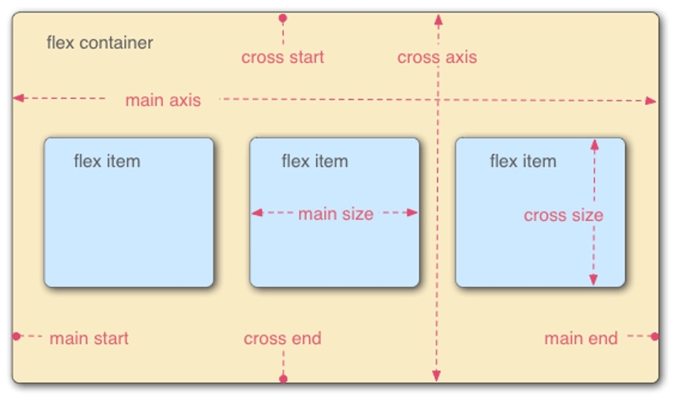

常规布局是基于块和内联流方向，而Flex布局是基于flex-flow流，Flex项目是沿着 main axis (从main-start向main-end) 或者 cross axis (从cross-start向cross-end) 排列。项目默认沿主轴排列，单个项目占据的主轴空间叫做 main size，占据的交叉轴空间叫做 cross size，如下：

- `main axis`（主轴）： 弹性项主要是沿着弹性容器的主轴进行排列的。需要注意的是，它不一定是水平的，这主要取决于 `flex-direction` 属性。
- `main-start`（主轴起点边）`main-end`（主轴终点边）：Flex 元素的排列从容器的主轴起点边开始，往主轴终点边结束。
- `main size` ： Flex 元素的在主轴方向的宽度或高度就是项目的主轴尺寸，Flex 元素的主轴尺寸属性是 width 或 height 属性，由哪一个对着主轴方向决定。
- `cross axis` ： 与主轴垂直相交的就是交叉轴（侧轴），它的方向由主轴决定。
- `cross-start`（交叉轴起点边）`cross-end`（交叉轴终点边）：伸缩行的排列从容器的交叉轴起点边开始，往交叉轴终点边结束。
- `cross size` ：Flex 元素的在交叉轴方向的宽度或高度就是项目的交叉轴长度，Flex 元素的交叉轴长度属性是 width 或 height 属性，由哪一个对着交叉轴方向决定。

Flex 属性分为两部分：

- 一部分作用于容器称 **容器属性**
- 另一部分作用于子项称为 **子项属性**

## 二、容器的属性

容器的属性常用的有以下6个：

1. flex-direction
2. flex-wrap
3. flex-flow
4. justify-content
5. align-items
6. align-content

#### flex-direction 排列方向

此属性主要 **决定主轴的方向** ，即项目的排列方向。

```css
.container {
    flex-direction: row | row-reverse | column | column-reverse;
}
```

- row（默认值）：主轴为水平方向，起点在左端，从左往右排列。

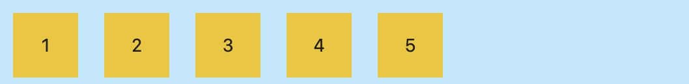

- row-reverse：主轴为水平方向，起点在右端，从右往左排列。

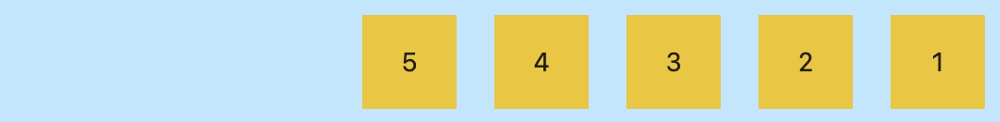

- column：主轴为垂直方向，起点在上沿，从上往下排列。

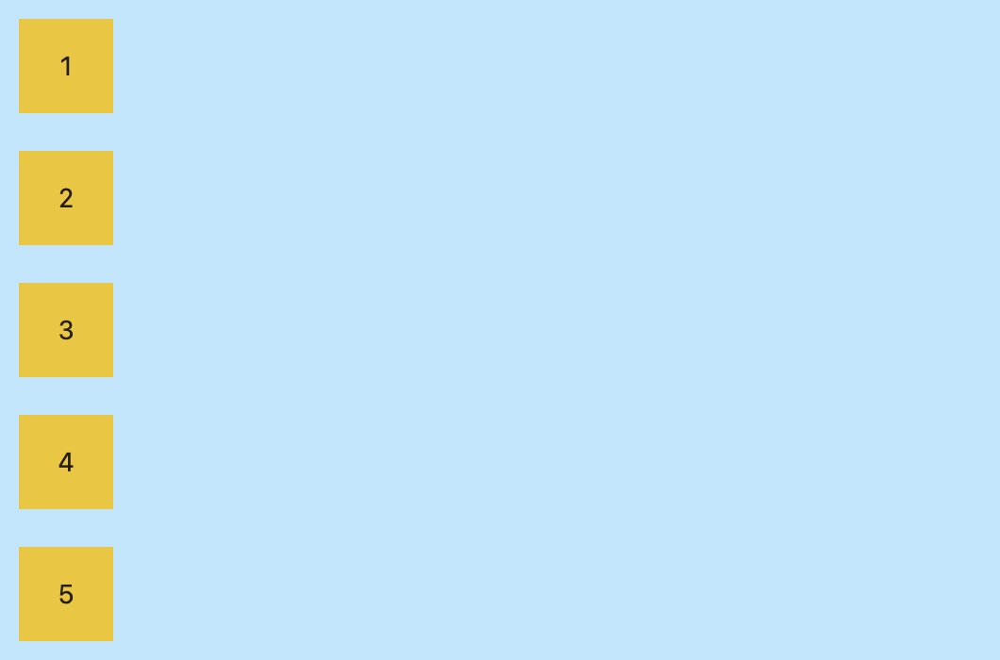

- column-reverse：主轴为垂直方向，起点在下沿，从下往上排列。

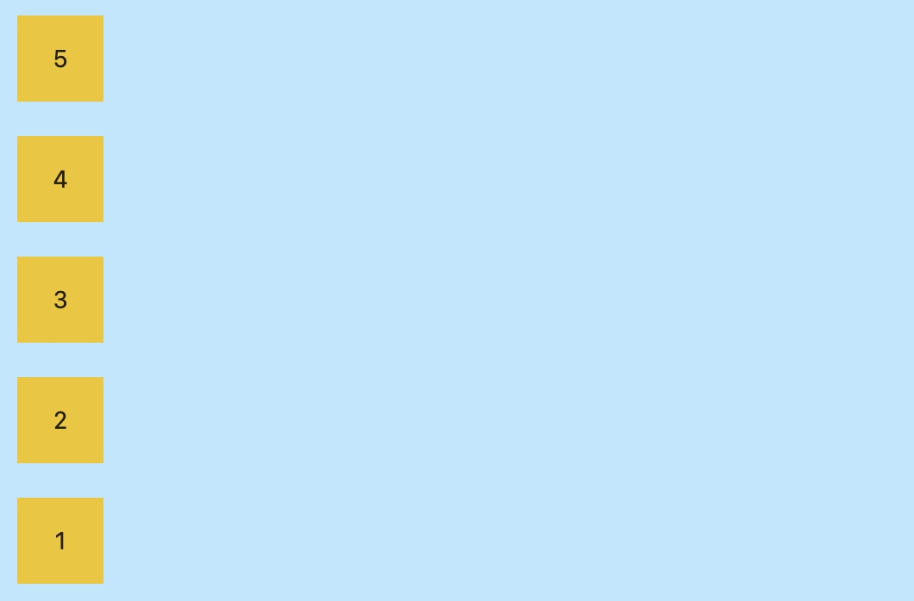

#### flex-wrap 多行显示

此属性定义了伸缩容器里是 **单行还是多行显示** ，交叉做的方向决定了新行堆放的方向。Flex项目都尽可能在一行显示，我们可以根据flex-wrap的属性值来改变，让Flex项目多行显示。

```css
.container {
    flex-wrap: nowrap | wrap | wrap-reverse;
}
```

- nowrap：默认属性，不换行。

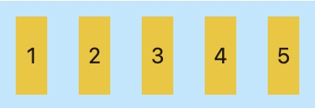

- wrap：换行，第一行在上方，方向从上往下。

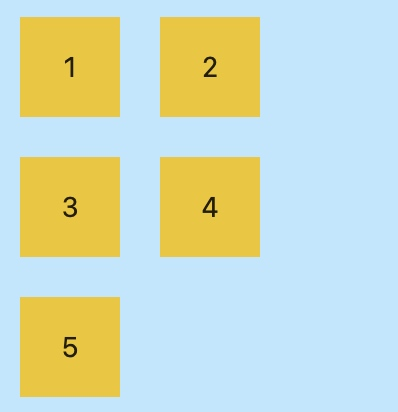

- wrap-reverse：换行，第一行在下方，方向从下至上。

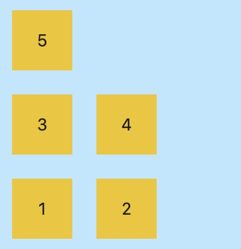

> **注意**：
> 使用该属性，需要 **给弹性容器添加固定宽度**，当弹性容器宽度超过子项宽度总和时，值设为 wrap 或 wrap-reverse 均不起效果.

#### flex-flow

此属性是 flex-direction 属性和 flex-wrap 属性的简写形式，默认值为 `row nowrap`。

```css
.container {
    flex-flow: < 'flex-direction' > || < 'flex-wrap' >;
}
```

### 对齐方式

#### justify-content 

此属性定义了项目在 **主轴上的对齐方式** 。

```css
.container {
    justify-content: flex-start | flex-end | center | space-between | space-around | space-evenly;
}
```

具体对齐方式与轴的方向有关，假设主轴方向为从左到右：

- flex-start（默认值）：子项按主轴起点线对齐，即左对齐

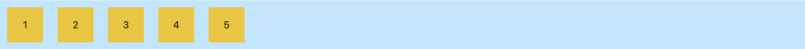

- flex-end：子项按主轴终点线对齐，即右对齐

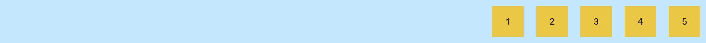

- center： 居中排列


- space-between：子项均匀分布，第一项紧贴主轴起点线，最后一项紧贴主轴终点线，子项目之间的间隔都相等。要注意特殊情况，当剩余空间为负数或者只有一个项时，效果等同于 flex-start。

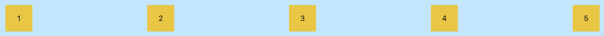

- space-around：每个项目两侧的间隔相等。并且，项目与容器边框的间隔是项目之间间隔的一半。要注意特殊情况，当剩余空间为负数或者只有一个项时，效果等同于 center。

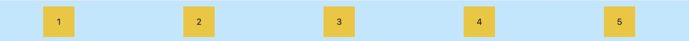

- space-evenly：弹性容器子项均匀分布，所有项目之间及项目与边框之间的距离相等。

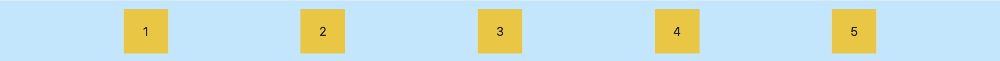

#### align-items

此属性定义项目在 **交叉轴上对齐方式** 。

```css
.container {
    align-items: flex-start | flex-end | center | baseline | stretch;
}
```

具体的对齐方式与交叉轴的方向有关，下面假设交叉轴从上到下：

- stretch（默认值）：如果项目未设置高度或设为auto，将占满整个容器的高度。

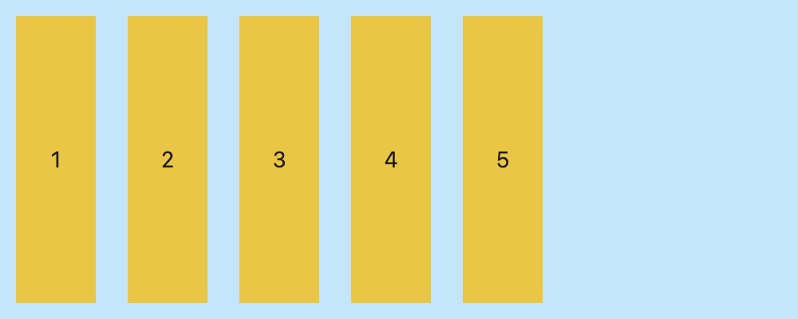

- flex-start：子项与交叉轴的起点线对齐。

.jpg)

- flex-end：子项与交叉轴的终点线对齐。

.jpg)

- center：与交叉轴的中线对齐。

.jpg)

- baseline: 项目的第一行文字的基线对齐。

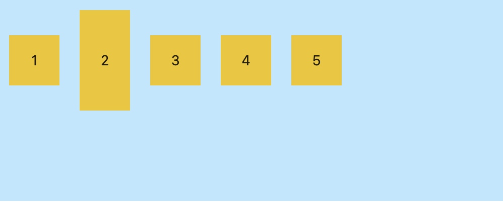

#### align-content

此属性定义了 **多根轴线的对齐方式** ，如果项目只有一根轴线，该属性不起作用。
核心是一定是盒子内部的元素超过了盒子项的宽度（默认）出现了换行，也就是 **出现多行才会起作用** 。

```css
.container {
    align-content: flex-start | flex-end | center | space-between | space-around | stretch;
}
```

- stretch（默认值）：轴线占满整个交叉轴。（如果子项设定了高度则无法展开）

.jpg)

- flex-start：表示各行与交叉轴的起点线对齐。

.jpg)

- flex-end：表示各行与交叉轴的终点对齐。

.jpg)

- center：表示各行与交叉轴的中心点对齐。

.jpg)

- space-between：与交叉轴两端对齐，轴线之间的间隔平均分布。要注意特殊情况，当剩余空间为负数时，效果等同于flex-start。

.jpg)

- space-around：每根轴线两侧的间隔都相等。所以，轴线与边框的间隔是轴线之间间隔的一半。要注
  意特殊情况，当剩余空间为负数时，效果等同于center。

.jpg)

> **注意**：
> 该属性只作用于多行的情况（`flex-warp: wrap / warp-reverse`），在只有一行的弹性容器上无效，另外该属性可以很好的处理，换行以后相邻行之间产生的间距。

## 三、项目的属性

项目的属性常用的有以下6个：

1. order
2. flex-grow
3. flex-shrink
4. flex-basis
5. flex
6. align-self

#### order 

此属性定义项目的排列顺序。**数值越小，排列越靠前，默认为0**。

```css
.item {
  order: 1;
}
```

#### flex-grow 

此属性定义 **项目的放大比例，默认为0**，即使存在剩余空间，也不放大。Flex 容器会根据子项设置的扩展比例作为比率来分配剩余空间。

- 当所有项目的flex-grow属性都为1，则它们将等分剩余空间（如果有剩余空间）。
- 如果一个项目的flex-grow属性为2，其他项目都为1，则前者占据的剩余空间将比其他项多一倍，如下：

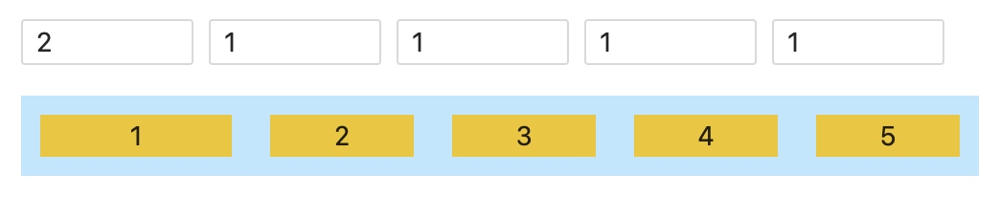

#### flex-shrink

如果子项宽度超过父容器宽度，即使是设置了 flex-grow，但是由于没有剩余空间，就分配不到剩余空间了。这时候有两个办法：换行和压缩。由于 flex 默认不换行，那么压缩的话，怎么压缩呢，压缩多少？此时就需要用到 flex-shrink 属性，定义了项目的 **缩小比例，默认为1**，即如果空间不足，该项目将缩小。

```css
.item {
    flex-shrink: <number>; /* default 1 */
}
```


- 如果所有项目的flex-shrink属性都为1，当空间不足时，都将等比例缩小。
- 如果一个项目的flex-shrink属性为0，其他项目都为1，则空间不足时，前者不缩小，如下：

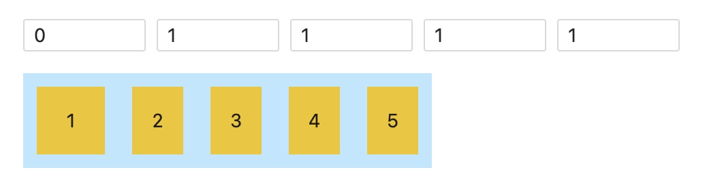

#### flex-basis

此属性定义了在分配多余空间之前，项目**占据的主轴空间**（main size）。浏览器根据这个属性，计算主轴是否有多余空间。它的默认值为auto，即项目的本来大小。

```css
.item {
    flex-basis: <number> | <percentage> | auto; /* default auto */
}
```

它可以设为跟width或height属性一样的值（比如350px），则项目将占据固定空间。

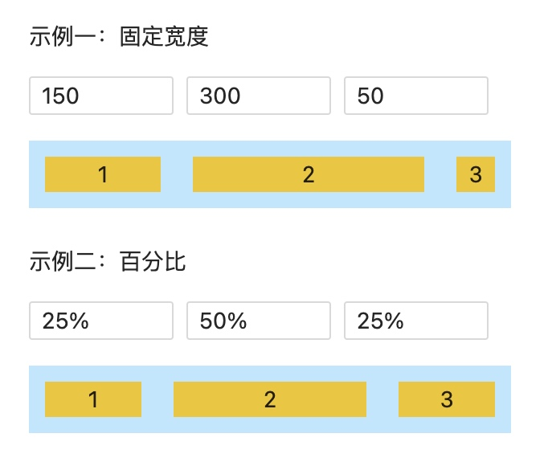

#### flex

此属性是flex-grow、flex-shrink 和 flex-basis的简写，默认值为 `0 1 auto`。后两个属性可选。

```css
.item {
    flex: none | [ < 'flex-grow' > < 'flex-shrink' >? || < 'flex-basis' > ];
}
```

该属性有两个快捷值：`auto (1 1 auto)` 和 `none (0 0 auto)`。建议优先使用这个属性，而不是单独写三个分离的属性，因为浏览器会推算相关值。

#### align-self 

此属性允许单个项目有与其他项目不一样的对齐方式，可覆盖 align-items 属性。
默认值为 auto，表示继承父元素的 align-items 属性，如果没有父元素，则等同于 stretch。

```css
.item {
    align-self: auto || flex-start || flex-end || center || baseline || stretch;
}
```

该属性可能取6个值，除了auto，其他都与align-items属性完全一致。以下案例中，我们以子项目 3 为例：

- auto

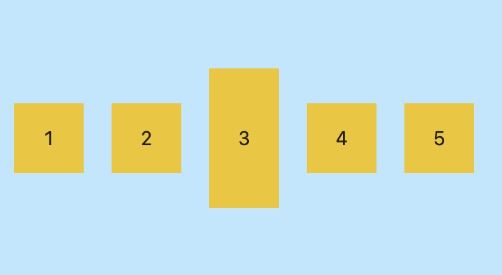

- flex-start

.jpg)

- flex-end

.jpg)

- center

.jpg)

- baseline

.jpg)

- stretch

.jpg)
