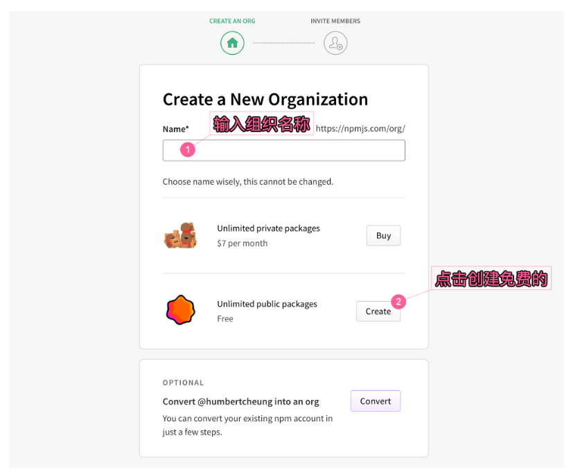
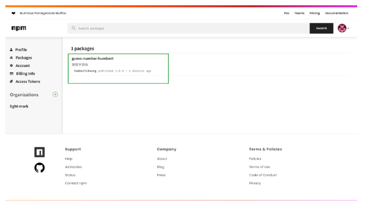

# Node.js 入门

Node.js® 是一个开源、跨平台的 JavaScript 运行时环境。基于Chrome V8引擎，使用了一个事件驱动、非阻塞I/O的模型，使其轻量又高效，非常适合数据密集型的实时应用。主要用于创建网络服务器，但不仅限于此。

[Node.js官方网站（中文）](https://nodejs.cn/)

## 认识 Node.js

### 服务端JavaScript

JavaScript最早是运行在浏览器中，然而浏览器只是提供了一个上下文，它定义了使用JavaScript可以做什么，但并没有“说”太多关于JavaScript语言本身可以做什么。事实上，JavaScript是一门“完整”的语言： 它可以使用在不同的上下文中。

**Node.js事实上就是另外一种上下文，它允许在后端（脱离浏览器环境）运行JavaScript代码。**

要实现在后台运行JavaScript代码，代码需要先被解释然后正确的执行。Node.js的原理正是如此，它使用了Google的V8虚拟机（Google的Chrome浏览器使用的JavaScript执行环境），来解释和执行JavaScript代码。

除此之外，伴随着Node.js的还有许多有用的模块，它们可以简化很多重复的劳作，比如向终端输出字符串。

因此，Node.js事实上既是一个运行时环境，同时又是一个库。

### 优势

1. 非阻塞 I/O 模型

Node.js 以其高效的非阻塞 I/O 模型而闻名。

- **I/O 操作(输入输出操作)**：I/O 操作涉及到与外部设备（如硬盘、网络等）进行数据交换的过程。在传统的同步 I/O 模型中，当进行一个 I/O 操作时，程序会被阻塞，直到操作完成才能继续执行下一步。
- **非阻塞**：在非阻塞模型中，程序可以在等待 I/O 操作完成的同时继续执行后续代码，而不必等待 I/O 操作完全完成。

Node.js 利用了 JavaScript 的事件驱动模型来实现非阻塞 I/O。其关键的组成部分是事件循环（Event Loop）和回调函数（Callback Functions）。

具体来说，Node.js 将 I/O 操作交给操作系统处理，然后通过事件循环等待操作系统的通知。当一个 I/O 操作完成时，操作系统会通知 Node.js，然后 Node.js 将相应的回调函数放入事件队列中。一旦事件队列中有回调函数，Node.js 就会执行这些回调函数，这样程序可以继续执行。

这种模型使得Node.js 不会阻塞线程和浪费 CPU 周期等待，允许程序能够在等待 I/O 操作完成的同时继续执行其他代码，从而提高了应用程序的性能和响应速度。进而能够高效地处理大量的并发连接，这对于构建高性能、高扩展性的网络应用程序非常有利。

1. Node.js 具有独特的优势，对于编写 JavaScript 的前端开发者现在除了客户端代码之外，还能够编写服务器端代码，而无需学习完全不同的语言。
2. 在 Node.js 中，可以毫无问题地使用新的 ECMAScript 标准，因为你不必等待所有用户更新他们的浏览器，可以通过更改 Node.js 版本来决定使用哪个 ECMAScript 版本

### 历史与发展

- 由Ryan Dahl于2009年首次发布。
- 社区迅速成长，多个版本迭代。

### 特点和应用领域

- 轻量、高效。
- 适用于Web服务器、实时应用、工具及命令行应用等。

## 使用 Node.js

### 安装

Node.js 可以通过不同的方式安装。可以通过 Node.js 官方的 [下载地址](https://nodejs.cn/download/) 中下载对应平台版本的安装包进行安装.

安装步骤非常简单，不需要特殊的配置，直接双击打开安装包运行，并按照安装向导进行安装即可。

在安装完成后，可以通过执行以下的命令来确认安装是否成功：

```bash
node -v
npm -v
```

> 如果能够正常出现版本信息，那么表明node.js 已经安装成功。


### 应用示例

我们实现一个最常见的 Hello World 的 Web 服务器。

#### 1. 初始化项目

首先我们通过 CMD 进入项目，然后执行 init 命令来完成项目的初始化。

```bash
npm init
```


执行之后会提示用户输入项目名称、版本、描述等配置信息，如果不需要设置则直接回车键使用默认值，此命令执行完毕后会在当前目录下生成一个默认的 package.json 文件

当然，如果想在执行 init 命令时自动接受所有默认配置，那么可以执行：

```bash
npm init -y
```


以上命令中，-y 标志表示"yes"的缩写，无需用户手动输入项目名称、版本、描述等信息。这对于快速初始化一个新项目非常方便。这在许多情况下是有用的，特别是在你已经知道了你的项目的基本信息，或者在需要快速地进行一些实验或原型开发时。

### 2. 创建一个简单的服务器

创建服务器入口文件 index.js，并且在其中创建简单的服务器

```js
const http = require('http');  // 导入 Node.js 内置的 HTTP 模块

const host = '127.0.0.1';  // 定义主机地址
const port = 3000;  // 定义端口号

const server = http.createServer((req, res) => {
  // 创建 HTTP 服务器，并指定请求处理函数
  res.statusCode = 200;  // 设置响应状态码为 200，表示成功
  res.setHeader('Content-Type', 'text/plain');  // 设置响应头，指定内容类型为纯文本

  // 发送响应内容
  res.end('Hello World');
});

server.listen(port, host, () => {
  // 启动服务器监听指定端口和主机
  console.log(`Server running at http://``{host}:``{port}`);  // 在控制台输出启动信息
});
```


### 3. 运行服务器

最后执行 node 命令来运行服务器，如下：

```bash
node index.js
```

代码构成

1. **require 指令**：在 Node.js 中，使用 require 指令来加载和引入模块，引入的模块可以是内置模块，也可以是第三方模块或自定义模块。
2. **创建服务器**：服务器可以监听客户端的请求，类似于 Apache 、Nginx 等 HTTP 服务器。
3. **接收请求与响应请求**： 服务器很容易创建，客户端可以使用浏览器或终端发送 HTTP 请求，服务器接收请求后返回响应数据。

### npm包管理器

npm 即 Node Package Manage，是 Node.js 的包管理器。主要用来安装、分享和管理 JavaScript 包的工具，让开发者能够轻松引入、管理和发布代码库。

我们为什么需要一个包管理工具呢？原因在于我们在Node.js上开发时，会用到很多别人写的JavaScript代码。如果我们要使用别人写的某个包，每次都根据名称搜索一下官方网站，下载代码，解压，再使用，非常繁琐。于是一个集中管理的工具应运而生：大家都把自己开发的模块打包后放到npm官网上，如果要使用，直接通过npm安装就可以直接用，不用管代码存在哪，应该从哪下载。

更重要的是，如果我们要使用模块A，而模块A又依赖于模块B，模块B又依赖于模块X和模块Y，npm可以根据依赖关系，把所有依赖的包都下载下来并管理起来。否则，靠我们自己手动管理，肯定既麻烦又容易出错。

npm 是随同 Node.js 一起安装的包管理器。它是一个命令行工具，允许开发者从 npm 仓库中安装、更新和卸载第三方模块（也就是 JavaScript 包）。此外，npm 也允许你将自己的模块发布到 npm 仓库中，使其可以被其他人使用。

Node.js 本身包含了一些基础模块（如 fs、http、path 等），但随着你的项目变得更加复杂，你可能会依赖于许多其他的第三方模块，这时就可以通过 npm 来管理这些依赖关系。

npm 提供了一个强大的生态系统，其中包含了数以百万计的开源 JavaScript 模块，可以极大地加速开发过程，因为你可以重用其他人已经编写好的代码。

#### npm 安装模块

我们可以通过以下命令来使用 npm 安装一个名为 express 的 Node.js web 应用程序框架：

```bash
npm install express
```

安装好之后，express 包就放在了工程目录下的 node_modules 目录中，因此在代码中只需要通过 require('express') 的方式就好，无需指定第三方包路径。

```js
var express = require('express');
```


#### 查看模块版本

如果要查看某个模块的版本号，可以使用命令如下：

```bash
npm list
```


如下：

```bash
test-server@1.0.0 /Users/humbertcheung/Desktop/node-server
└── express@4.18.2
```


#### 全局安装与本地安装

npm 的包安装分为本地安装（local）、全局安装（global）两种：

```bash
npm install express          # 本地安装
npm install express -g       # 全局安装
```


##### 本地安装

1. 将安装包放在 ./node_modules 下（运行 npm 命令时所在的目录），如果没有 node_modules 目录，会在当前执行 npm 命令的目录下生成 node_modules 目录。
2. 可以通过 require() 来引入本地安装的包。

##### 全局安装

1. 将安装包放在 /usr/local 下或者你 node 的安装目录。
2. 可以直接在命令行里使用。

#### 使用 package.json

package.json 位于模块的目录下，用于定义包的属性。接下来让我们来看下 express 包的 package.json 文件，位于 node_modules/express/package.json 内容：

```json
{
  "name": "test-server",
  "version": "1.0.0",
  "description": "test-project",
  "main": "index.js",
  "scripts": {
    "test": "echo \"Error: no test specified\" && exit 1"
  },
  "author": "humbertcheung",
  "license": "MIT",
  "dependencies": {
    "express": "^4.18.2"
  }
}
```


##### Package.json 属性说明

- name - 包名。
- version - 包的版本号。
- description - 包的描述。
- homepage - 包的官网 url 。
- author - 包的作者姓名。
- contributors - 包的其他贡献者姓名。
- dependencies - 依赖包列表。如果依赖包没有安装，npm 会自动将依赖包安装在 node_module 目录下。
- repository - 包代码存放的地方的类型，可以是 git 或 svn，git 可在 Github 上。
- main - main 字段指定了程序的主入口文件，require('moduleName') 就会加载这个文件。这个字段的默认值是模块根目录下面的 index.js。
- keywords - 关键字

#### 卸载模块

我们可以使用以下命令来卸载 Node.js 模块。

```bash
npm uninstall express
```


卸载后，你可以到 /node_modules/ 目录下查看包是否还存在

#### 更新模块

我们可以使用以下命令更新模块：

```bash
npm update express
```


#### 搜索模块

使用以下来搜索模块：

```bash
npm search express
```


#### 切换镜像源

由于国内直接使用 npm 的官方镜像有时会非常慢的，一般推荐使用淘宝 NPM 镜像。
淘宝 NPM 镜像是一个完整 `npmjs.org` 镜像，你可以用此代替官方版本(只读)，同步频率目前为 `10分钟` 一次以保证尽量与官方服务同步。

你可以使用淘宝定制的 cnpm (gzip 压缩支持) 命令行工具代替默认的 npm:

```bash
npm install -g cnpm --registry=https://registry.npmmirror.com
```


这样就可以使用 cnpm 命令来安装模块了：

```bash
cnpm install [name]
```


## Node.js 模块

模块是 Node.js 中用于组织代码的基本单元，可以是一个文件或一个文件夹。每个模块都有自己的作用域，可以包含变量、函数和对象。

### 自定义模块

1. 创建模块并导出

如下，创建一个 math.js，导出运算函数：

```js
// math.js
const add = (a, b) => a + b;
const subtract = (a, b) => a - b;
const multiply = (a, b) => a * b;
const divide = (a, b) => a / b;

module.exports = {
  add,
  subtract,
  multiply,
  divide
};
```


模块可以通过 module.exports 导出一个对象，也可以直接导出一个函数、变量等。也可以使用 exports 对象的属性进行导出。

```js
// math.js
exports.add = (a, b) => a + b;
exports.subtract = (a, b) => a - b;
```


1. 导入模块

模块导入使用 require 来实现，在 require 中的模块名可以是相对路径或者绝对路径，也可以是模块名（会去 node_modules 文件夹中查找）。

```js
const http = require('http');  // 导入 Node.js 内置的 HTTP 模块
const myMath = require('./math')

const host = '127.0.0.1';  // 定义主机地址
const port = 3000;  // 定义端口号

const server = http.createServer((req, res) => {

  // 发送响应内容
  res.end('Result: ' + myMath.multiply(32, 32));  // 发送响应数据
});

server.listen(port, host, () => {
  // 启动服务器监听指定端口和主机
  console.log(`Server running at http://``{host}:``{port}`);  // 在控制台输出启动信息
});
```


### 内置模块或第三方模块

Node.js 提供了许多内置模块，如 fs、http 等。此外，你可以使用 npm 来安装并使用第三方模块。

如下，安装 request 模块：

```bash
npm install request
```


导入并使用 request:

```js
const request = require('request');
```


模块化编程是近年来编程领域的一种流行趋势，它的出现和普及有其深刻的原因：

- 代码重用：模块化允许开发者创建可复用的代码片段。这不仅提高了代码的重用性，还降低了开发时间和成本。
- 命名空间隔离：在大型应用中，可能会有多个开发者或团队同时工作。模块化可以有效地避免变量和函数的命名冲突。
- 便于维护：模块化的代码结构更加清晰，易于维护。如果需要修改某个功能，只需要定位到对应的模块进行更改。
- 延迟加载：在某些场景下，我们可能不需要立即加载所有代码。通过模块化，可以实现按需加载，优化应用性能。

### CommonJS规范概述

CommonJS 是一种使得 JavaScript 可以在任何地方运行的项目，而不仅仅是在浏览器中。它为JavaScript制定了一个简单的模块系统。以下是其主要特点：

- 同步加载：CommonJS模块在加载时是同步的，意味着模块的加载、解析和执行都是在同一时间完成的。这适用于服务器端，因为模块文件通常都存放在本地硬盘，读取速度很快。但在浏览器环境，这可能会导致性能问题。
- 每个文件是一个模块：在CommonJS规范中，每一个JavaScript文件都被视为一个独立的模块。
- 局部作用域：CommonJS模块中的变量、函数等都只在该模块内部有效，不会污染全局作用域。
- module.exports：每个模块都有一个module对象，module.exports属性用于定义该模块对外暴露的内容。
- require函数：用于加载其他模块，返回被加载模块的exports对象。

## 在 npm 发布包

### 前提条件--创建一个npm账户

如果你还没有npm账户，你需要创建一个。你可以在命令行里运行以下命令：

```bash
npm adduser
```


或者，你可以直接在[npm官方网站](https://www.npmjs.com/)上注册。

注册好之后，创建组织 rganization(非必须)



### 步骤1. 创建目录并初始化项目

```bash
mkdir guess-number
cd guess-number
npm init -y
```


### 步骤 2: 创建一个简单的服务器文件，如下，创建一个猜数字的小游戏

创建一个名为 server.js 的文件，并添加以下代码：

```js
/*
 * @Description: 猜数字小游戏
 * @Version: 1.0
 * @Author: Humbert Cheung
 * @Date: 2023-10-24 09:10:34
 * @LastEditors: [Humbert Cheung]
 * @LastEditTime: 2023-10-24 09:10:48
 * @FilePath: /guess-number/server.js
 * right (C) 2023 syzhang. All rights reserved.
 */
const http = require('http');
const url = require('url');

// 预设一个随机数，范围1-100
const secretNumber = Math.floor(Math.random() * 100) + 1;

const server = http.createServer((req, res) => {
  const queryObject = url.parse(req.url, true).query;

  // 如果没有传递猜测的数字或数字无效，返回错误提示
  if (!queryObject.guess || isNaN(queryObject.guess)) {
    res.end('Please guess a number between 1 and 100 by appending ?guess=YOUR_NUMBER to the URL.');
    return;
  }

  const userGuess = parseInt(queryObject.guess, 10);

  if (userGuess === secretNumber) {
    res.end('Congratulations! You guessed it right!');
  } else if (userGuess < secretNumber) {
    res.end('Try a larger number.');
  } else {
    res.end('Try a smaller number.');
  }
});

server.listen(3000, () => {
  console.log('Game server started at http://localhost:3000');
  console.log(`Secret number is: ${secretNumber} (Don't tell the players!)`);
});
```


### 步骤3. 测试服务器

```bash
node  server.js
```

在浏览器中访问 http://localhost:3000?guess=50（这里的50是猜测的数字，可以更改）。

### 步骤4. 发布 npm 包

需要在根目录下创建一个 index.js 文件，用来导出服务器的：

```js
const http = require('http');
const url = require('url');

// 预设一个随机数，范围1-100
const secretNumber = Math.floor(Math.random() * 100) + 1;

const server = http.createServer((req, res) => {
  const queryObject = url.parse(req.url, true).query;

  // 如果没有传递猜测的数字或数字无效，返回错误提示
  if (!queryObject.guess || isNaN(queryObject.guess)) {
    res.end('Please guess a number between 1 and 100 by appending ?guess=YOUR_NUMBER to the URL.');
    return;
  }

  const userGuess = parseInt(queryObject.guess, 10);

  if (userGuess === secretNumber) {
    res.end('Congratulations! You guessed it right!');
  } else if (userGuess < secretNumber) {
    res.end('Try a larger number.');
  } else {
    res.end('Try a smaller number.');
  }
});

module.exports = server
```


基于以上的 server.js 代码，去掉 listen 部分，直接将服务器导出即可。

### 步骤6. 修改 package 信息：

```json
{
  "name": "guess-number-humbert",
  "version": "1.0.0",
  "description": "猜数字游戏",
  "main": "index.js",
  "scripts": {
    "test": "echo \"Error: no test specified\" && exit 1"
  },
  "keywords": [],
  "author": "humbertcheung",
  "license": "MIT"
}
```


### 步骤7. 发布 npm 包

使用以下命令发布，先进行登录授权，没问题后再发布：

```bash
npm login
npm publish
```

上传成功在 npm 官网便可看到此项目：



### 删除 npm 包

可以使用 `npm unpublish` 命令删除已上传的npm包。

- **版本删除**: 如果只想删除某个特定版本的包，可以指定版本号来删除它。
- **整个包删除**: 如果想删除整个包，需要谨慎操作，因为这将永久删除它。
- **时间限制**: 出于安全和数据完整性的考虑，npm不允许在发布后的72小时内取消发布包。如果您需要在这个时间内删除包，可能需要联系npm支持。

#### 1. 删除特定版本的包

```bash
npm unpublish [package_name]@[version]
```

例如

```bash
npm unpublish guess-number-game@1.0.0
```

#### 2. 删除整个包

```bash
npm unpublish [package_name] --force
```

例如：

```bash
npm unpublish guess-number-game --force
```


# Node 文件与路径

## 一、认识文件系统模块

Node.js文件系统模块是一个封装了I/O操作的集合。使用这个模块，其中所有的方法都有同步和异步两种模式。

异步方法**最后一个参数都是回调函数**，这个回调的参数取决于方法，不过第一个参数一般都是异常。如果操作成功，那么第一个参数就是null或undefined。

当使用一个同步操作的时候，任意的异常都立即抛出，可以用try/catch来处理异常，使得程序正常运行。

> Tips:
> 建议大家使用异步方法，比起同步，异步方法性能更高，速度更快，而且没有阻塞。

导入文件系统模块(fs)的语法如下：

```js
const fs = require("fs")
```


## 二、基本文件操作

### 1、文件读取操作

#### 创建读取的文件

首先我们需要先创建一个 input.txt 文件，并在此文件中输入以下内容：

```txt
Node.js 是一个免费、开源、跨平台的 JavaScript 运行时环境，
允许开发人员在浏览器之外编写命令行工具和服务器端脚本。
```


#### 创建 file.js，并实现文件的读取：

**异步操作**

```js
const fs = require('fs')

// 异步读取操作
fs.readFile('input.txt', 'utf-8', (err, data) => {
  if (err) {
    return console.error(err);
  }
  console.log("异步读取到的数据：\n" + data.toString());
})
```


**同步操作**

```js
const fs = require('fs')

// 同步读取操作
try {
  const data = fs.readFileSync('input.txt', 'utf-8');
  console.log("同步读取到的数据：\n" + data.toString());
} catch (err) {
  console.error(err);
}
```


### 2、文件写入操作

通过 `fs.writeFile()` 来将数据写入到文件中，代码如下：

```js
const fs = require('fs')

// 文件写入操作
const content = "这是一段需要写入到本地文件的内容。"
fs.writeFile('output.txt', content, (err) => {
  if (err) throw err;
  console.log("The file was saved!");
})
```

### 3、检查文件状态

通过 `fs.stat()` 来检查文件的状态，在其回调函数中可以通过第 stats 参数来获取相关状态，代码如下：

```js
const fs = require('fs')

// 检查文件状态
fs.stat('output.txt', (err, stats) => {
  if (err) throw err;
  console.log(stats);
  console.log(`File size: ${stats.size} bytes`);
})

// 输出:
//  Stats {
//   dev: 16777232,
//   mode: 33188,
//   nlink: 1,
//   uid: 501,
//   gid: 20,
//   rdev: 0,
//   blksize: 4096,
//   in0: 49736811,
//   size: 51,
//   blocks: 8,
//   atimeMs: 1698135252673.6626,
//   mtimeMs: 1698135251233.6123,
//   ctimeMs: 1698135251233.6123,
//   birthtimeMs: 1698135251233.3376,
//   atime: 2023-10-24T08:14:12.674Z,
//   mtime: 2023-10-24T08:14:11.234Z,
//   ctime: 2023-10-24T08:14:11.234Z,
//   birthtime: 2023-10-24T08:14:11.233Z
//  }
//  File size: 51 bytes
```

#### 判断文件类型

| 方法                      | 描述                                                         |
| ------------------------- | ------------------------------------------------------------ |
| stats.isFile()            | 如果是文件返回 true，否则返回 false。                        |
| stats.isDirectory()       | 如果是目录返回 true，否则返回 false。                        |
| stats.isBlockDevice()     | 如果是块设备返回 true，否则返回 false。                      |
| stats.isCharacterDevice() | 如果是字符设备返回 true，否则返回 false。                    |
| stats.isSymbolicLink()    | 如果是软链接返回 true，否则返回 false。                      |
| stats.isFIFO()            | 如果是FIFO，返回true，否则返回 false。FIFO是UNIX中的一种特殊类型的命令管道。 |
| stats.isSocket()          | 如果是 Socket 返回 true，否则返回 false。                    |


### 4、删除文件

通过 `fs.unlink()` 来删除文件， 代码如下：

```js
// 文件删除操作
fs.unlink('output.txt', (err) => {
  if (err) throw err;
  console.log("The file was deleted!");
})
```

## 三、流的概念和应用

### 数据流

数据的连续传输方式，允许数据从来源被发送和处理，而不需要全部加载到内存中。

**为什么使用流？**

- 高效：对于大数据量，不需要一次性加载，节省内存。
- 实时：数据可以边读边处理，不必等待全部数据传输完成。

### 流的种类

#### 1. 可读流：从来源读取数据的流

使用 `fs.createReadStream` 方法读取文件

```js
const fs = require('fs')

const readStream = fs.createReadStream('input.txt', 'utf-8')
readStream.on('data', (chunk) => {
  console.log(chunk);
})
```


#### 2. 可写流：项目表写入数据的流

使用 `fs.createWriteStream` 方法写入文件

```js
const fs = require('fs')

const writeStream = fs.createWriteStream('output.txt')
writeStream.write("这是通过可写流写入的文件内容。")
writeStream.end()
```


### 3. 双向流

既可以读取又可以写入的流，常用于数据的转换和处理，如下使用 zlib 模块创建一个gzip压缩流：

#### **文件压缩**

```js
const fs = require('fs');
// 导入Node.js内置的zlib模块，用于处理压缩和解压缩操作
const zlib = require('zlib')
// 创建一个gzip压缩器
const gzip = zlib.createGzip()
// 使用fs模块创建一个可读流，用于读取名为'input.txt'的文件
const input = fs.createReadStream('input.txt')
// 使用fs模块创建一个可写流，用于将压缩后的数据写入名为'input.txt.gz'的文件
const output = fs.createWriteStream('input.txt.gz')
// 将可读流通过gzip压缩，然后将压缩后的数据通过可写流写入文件
input.pipe(gzip).pipe(output)
```

以上 `pipe` 是 Node.js 中用于将数据从一个可读流传输到一个可写流的方法。`input.pipe(gzip)` 将可读流 input 的数据传输到了 gzip 这个压缩器中，然后 gzip 压缩后的数据被传输到了 output 这个可写流中。

这种方式可以有效地处理大量的数据，而不需要一次性将整个数据集加载到内存中，这对于处理大文件或网络传输时非常重要。通过逐块地处理数据，可以节省内存并提高程序的性能。

#### **文件解压**

```js
const zlib = require('zlib');
const fs = require('fs');
// 创建一个解压缩器
const gunzip = zlib.createGunzip();
// 创建一个可读流，用于读取压缩后的文件
const compressedFile = fs.createReadStream('input.txt.gz');
// 创建一个可写流，用于写入解压后的数据
const output = fs.createWriteStream('output-unpack.txt');
// 将压缩后的数据通过解压缩器，然后将解压后的数据通过可写流写入文件
compressedFile.pipe(gunzip).pipe(output);
```

### 流的事件与控制流

#### 常见的流事件

- **data**：当有数据可读时触发。
- **end**：当所有数据已被读取时触发。
- **error**：在发生错误时触发。
- **finish**：当所有数据已被写入底层系统时触发。

#### 控制流

`pipe()` 方法：连接可读流和可写流，自动管理数据的流动。如下例子，将一个文件的内容复制到另一个文件：

```js
const readStream = fs.createReadStream('source.txt');
const writeStream = fs.createWriteStream('destination.txt');
readStream.pipe(writeStream);
```


#### 流的错误处理

为流添加 error 事件监听器来处理可能出现的错误。

```js
readStream.on('error', (err) => {
    console.error('An error occurred:', err.message);
});
```


#### 服务器中使用流

```js
const http = require('http');
const fs = require('fs')

const server = http.createServer((req, res) => {
    const stream = fs.createReadStream(`.${req.url}`);
    stream.pipe(res);
});
server.listen(3000, () => {
    console.log(`Server running at http://127.0.0.1:3000`);
});
```


以上代码，对于每一个HTTP请求，都试图在服务器的当前目录下找到一个与请求URL匹配的文件。例如，如果请求的URL是 `/index.html`，那么服务器会尝试读取当前目录下的 `index.html`文件。

## 四、路径与地址

### 路径处理模块 `path`

- 绝对路径：从文件系统的根目录到文件的完整路径。
- 相对路径：相对于当前工作目录或当前文件的路径。

#### 常用的路径方法

##### 1、path.join( )：连接路径片段

示例：连接多个路径片段。

```js
const path = require('path');
const fullPath = path.join(__dirname, 'subfolder', 'file.txt');
console.log(fullPath);  // 输出：/Users/humbertcheung/Desktop/node-web3/subfolder/file.txt
```


##### 2、path.resolve( )：解析为绝对路径

示例：从相对路径解析到绝对路径。

```js
const path = require('path');
const absolutePath = path.resolve('subfolder', 'file.txt');
console.log(absolutePath); // 输出：/Users/humbertcheung/Desktop/node-web3/subfolder/file.txt
```


##### 3、path.extname( )：获取文件扩展名

示例：检查文件的扩展名。

```js
const path = require('path');
const extension = path.extname('sample.txt');
console.log(extension);  // 输出: .txt
```


##### 4、path.dirname( )：获取目录名

示例：从文件路径中提取目录。

```js
const path = require('path');
const directory = path.dirname('/path/to/sample.txt');
console.log(directory);  // 输出: /path/to
```


##### 5、path.basename()：获取基本文件名

示例：从文件路径中提取文件名。

```js
const path = require('path');
const filename = path.basename('/path/to/sample.txt');
console.log(filename);  // 输出: sample.txt
```


### URL的基本结构与操作

#### URL的组成部分

- 协议：如 http 或 https
- 域名/主机：如 [www.example.com](http://www.example.com)
- 端口：如 80 或 443
- 路径：如 /about 或 /products/item1
- 查询参数：如 ?id=123&user=alice
- 锚点：如 #section1

#### url 模块

使用 url 模块解析和构造URL:

##### 1、 url.parse( )：将URL字符串转换为URL对象

示例：

```js
const url = require('url');
const parsedUrl = url.parse('https://www.example.com:80/about?user=alice#section1');
console.log(parsedUrl.protocol);  // 输出: https:
console.log(parsedUrl.hostname);  // 输出: www.example.com
```


##### 2、url.format( )：将URL对象转换为URL字符串

示例：

```js
const url = require('url');
const urlString = url.format({
    protocol: 'https',
    hostname: 'www.example.com',
    port: '80',
    pathname: '/about',
    query: { user: 'alice' },
    hash: '#section1'
});
console.log(urlString);  // 输出: https://www.example.com:80/about?user=alice#section1
```


##### 3、url.resolve( )：解析浏览器超链接，生成绝对URL

示例：

```js
const url = require('url');
const resolvedUrl = url.resolve('https://www.example.com/', '/about');
console.log(resolvedUrl);  // 输出: https://www.example.com/about
```


# Node 事件与HTTP模块

## 一、事件与异步编程

### 1、事件驱动编程模型

在传统的编程模型中，我们可能习惯了线性地、从上到下地执行代码。但在Node.js中，我们使用的是一个不同的模型，它被称为 **事件驱动编程模型**。

**特点**

- 单线程：Node.js 采用的事单线程的事件驱动模型，不过因为 V8 引擎提供的异步执行回调接口，通过这些接口可以处理大量的并发，所以性能非常高。
- 事件循环：由于了有事件循环，Node.js可以在背后等待事件发生，而不是闲置。当观察到事件发生后，会处理这些事件并执行相应的回调函数。

> **实际应用：**
> 与传统的多线程/多进程模型相比，事件驱动提供了更高的并发性和更低的开销。

### 2、异步编程与回调函数

- Node.js 异步编程的直接体现就是回调。
- 异步编程依托于回调来实现，但不能说使用了回调后程序就异步化了。
- 回调函数在完成任务后就会被调用，Node 使用了大量的回调函数，Node 所有 API 都支持回调函数。

意味着，当我们要读取一个文件或发出一个网络请求时，Node.js不会等待操作完成，而是继续执行其他代码。一旦操作完成，一个回调函数会被调用，告诉我们结果。这样在执行代码时就没有阻塞或等待文件 I/O 操作。这就大大提高了 Node.js 的性能，可以处理大量的并发请求。

**阻塞型操作**

如之前实现同步的文件读取操作，就是典型的阻塞操作：

```js
// 同步读取操作
const fs = require('fs')
const data = fs.readFileSync('input.txt', 'utf-8');
console.log("同步读取到的数据：\n" + data.toString());
console.log("程序执行结束!");
```


输出结果：

```bash
同步读取到的数据：
Node.js 是一个免费、开源、跨平台的 JavaScript 运行时环境，
允许开发人员在浏览器之外编写命令行工具和服务器端脚本。

程序执行结束!
```


可以看出需要在文件读取完后才会接着执行程序。

**非阻塞型操作（异步）**

回调函数一般作为函数的最后一个参数出现，比如之前异步读取文件的操作：

```js
const fs = require('fs')

// 异步读取操作
fs.readFile('input.txt', 'utf-8', (err, data) => {
  if (err) {
    return console.error(err);
  }
  console.log("异步读取到的数据：\n" + data.toString());
})
console.log("程序执行结束!");
```


输出结果：

```bash
程序执行结束!
异步读取到的数据：
Node.js 是一个免费、开源、跨平台的 JavaScript 运行时环境，
允许开发人员在浏览器之外编写命令行工具和服务器端脚本。
```


可以看得出我们不需要等待文件读取完，这样就可以在读取文件时同时执行接下来的代码，大大提高了程序的性能。

## 二、HTTP模块

Node.js为我们提供了一个强大的HTTP模块，我们可以用它创建服务器和客户端。

主要的应用有以下两部分:

- **http.createServer**：作为web服务器，监听HTTP客户端请求并返回响应。
- **http.createClient**：作为客户端，发起一个请求，获取服务端响应，还可以实现爬虫之类的工作。

### （一）HTTP 服务器

#### 1、创建服务器

在之前的案例中，我们已经初步接触了创建服务器、启动服务器的基本操作：

```js
const http = require('http');
const server = http.createServer((req, res) => {
    res.end('Hello, Node.js!');
});
server.listen(3000);
```


以上代码:

- 首先, 通过 `require('http')` 引入http模块。
- 然后, 通过 `http.createServer([requestListener])` 来创建一个web服务器，并传入一个可选的回调函数，回调函数有两个参数分别代表客户端请求对象 `request` 和服务器端的响应对象`response`；以上案例中的服务器会对每个请求响应 **'Hello, Node.js!'**。
- 最后, 使用 `server.listen([port][, hostname][, backlog][, callback])`, 开始在指定的 port 和 hostname 上接受 http 请求并做出响应。

通过以上3步, 便可创建了一个简单的http服务器。

#### 2、关闭服务器

如何关闭刚刚创建的http服务器呢?

```js
server.close([calback])
```


#### 3、超时设置

Node.js http 模块也提供了 `server.timeout` 用于设置服务器的超时时间，单位是毫秒。此属性的默认值是120000毫秒（2分钟）。如果在指定的时间内没有收到请求，服务器将自动关闭连接。

```js
// 设置超时时间为3分钟
server.timeout = 180000;
```


#### 4、request 对象

request 对象是 Node.js HTTP 服务的一个核心对象，它包含了客户端请求的所有信息。

##### 常用属性与方法

- request.url： 获取请求的URL字符串。
- request.headers： 获取请求头对象，它包含了所有的HTTP请求头信息。
- request.method： 获取HTTP请求方法，一般有几个选项，POST,GET和DELETE等，服务器可以根据客户端的不同请求方法进行不同的处理。
- request.httpVersion： 获取HTTP协议的版本。
- request.trailers： 存放附加的一些http头信息
- request.socket： 用于监听客户端请求的socket对象

如下，可以将请求信息通过写入流写入到一个文件中：

```js
const http = require('http')
const fs = require('fs')

const server = http.createServer((request, response) => {
    response.statusCode = 200
    response.setHeader('Content-Type', 'text/plain')
    if (request.url === '/') {
        let logFile = fs.createWriteStream('./log.txt')
        logFile.write(`请求方法：${request.method} \r\n`)
        logFile.write(`请求url：${request.url} \r\n`)
        logFile.write(`请求头对象：${JSON.stringify(request.headers, null, 4)} \r\n`)
        logFile.write(`请求http版本：${request.httpVersion} \r\n`)
    }
    response.end('Hello World\r\n')
})

server.listen(3000, '127.0.0.1', () => {
    console.log('Server running at http://127.0.0.1:3000')
})
```


- request.setEncoding(encoding)：设置请求的字符编码。

> ```js
> request.setEncoding('utf8');
> ```
>
> 

- request.on(event, listener):

为请求对象添加事件监听器。常用事件包括 data（当接收到请求体数据时触发）和 end（当请求接收完毕时触发）

```js
request.on('data', (chunk) => {
    console.log(chunk);  // 打印接收到的数据块
});

request.on('end', () => {
    console.log('Request received.');
});
```


#### 5、response 对象

response 对象是 Node.js HTTP 服务的另一个核心对象，它包含了向客户端发送响应的所有方法和属性,可以控制 HTTP 响应的各个方面，包括状态码、头信息和响应体。以下是 response 对象中一些常用的属性和方法：

##### 常用属性与方法

- res.statusCode: 设置 HTTP 响应的状态码。

```js
res.statusCode = 200;
```


- res.setHeader(name, value): 设置 HTTP 响应头。

```js
res.setHeader('Content-Type', 'text/plain');
```


- res.writeHead(statusCode[, statusMessage][, headers]): 同时设置 HTTP 状态码、状态消息和响应头。

```js
res.writeHead(200, {'Content-Type': 'text/plain'});
```


- res.write(chunk[, encoding][, callback]): 向 HTTP 响应体写入数据。

```js
res.write('Hello World\n');
```


- res.end([data][, encoding][, callback]): 结束 HTTP 响应，可选地发送最后的数据块。

```js
res.end('Goodbye World\n');
```


- res.removeHeader(name): 移除已设置的 HTTP 响应头。

```js
res.removeHeader('Content-Encoding');
```


- res.setTimeout(msecs, callback): 设置发送完毕响应之前的超时时间，并在超时时执行回调函数。

```js
res.setTimeout(5000, () => {
    console.log('Response timeout.');
});
```


- res.getHeader(name): 获取已设置的 HTTP 响应头。

```js
const contentType = res.getHeader('Content-Type');
```


- res.addTrailers(headers): 在消息尾部添加 HTTP 尾部头。

```js
res.addTrailers({'Content-MD5': '7895bf4b8828b55ceaf47747b4bca667'});
```


### （二）HTTP客户端

Node.js 内置的 `http` 模块提供了 `http.request` 和 `http.get` 两个函数，可以实现由客户端向 HTTP 服务器发起网络请求:

#### 1、http.request

对百度首页进行网络请求，打印出响应成功的200状态码和百度首页的HTML代码。

```js
const http = require('http')

const options = {
    hostname: 'www.baidu.com', //地址
    port: 80, //端口号
    method: 'GET' //请求方法
};

const req = http.request(options, function (res) {
    res.setEncoding("utf-8"); //中文编码
    res.on("data", function (data) {
        console.log(data) //获取的网页数据
    });
    console.log(res.statusCode); //打印状态码
});
req.on("error", function (err) {
    console.log(err.message); //报错信息
});
req.end();  //结束请求
```


#### 2、http.get

```
http.get` 就相当于是 `http.requset` 的简化版，且是不需要手动调用 `req.end()
const http = require('http')

http.get('http://www.baidu.com/', function (res) {
    res.setEncoding("utf-8")
    res.on("data",function(data){
        console.log(data) //获取的网页数据
    });
});
```